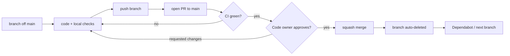

# Contributing to Binexus Platform

Welcome. This document is the **single source of truth** for the dev workflow. Following it keeps the codebase healthy and `main` releasable at every commit.

> Mantra: **Foundation wide. Execution narrow.**

---

## 1. Quick start

```bash
pnpm install
pnpm docker:up                # postgres, redis, minio
pnpm db:migrate
pnpm db:seed
pnpm dev                      # backend (:3001) + web (:3000)
```

Before opening a PR:

```bash
pnpm format
pnpm exec turbo run typecheck lint build
```

CI will run the same suite on GitHub.

---

## 2. Branching model — trunk based

We use a single long-lived branch: `main`. Everything else is short-lived.

- `main` is **always green** and always deployable.
- All work happens on a short-lived branch off `main`.
- Branch is merged via Pull Request — never push directly to `main`.

### Branch naming

`<type>/<short-kebab-description>` (optionally `<type>/<issue>-<description>`).

| Prefix      | When                                | Example                      |
| ----------- | ----------------------------------- | ---------------------------- |
| `feat/`     | New capability                      | `feat/orders-create-command` |
| `fix/`      | Bug fix                             | `fix/jwt-refresh-rotation`   |
| `refactor/` | Internal change, no behavior change | `refactor/extract-event-bus` |
| `docs/`     | Docs only                           | `docs/orders-state-machine`  |
| `chore/`    | Tooling, deps, repo housekeeping    | `chore/bump-prisma-7`        |
| `test/`     | Tests only                          | `test/auth-service`          |
| `perf/`     | Performance                         | `perf/feature-flag-cache`    |
| `ci/`       | CI / workflows                      | `ci/cache-pnpm-store`        |
| `build/`    | Build scripts, packaging            | `build/tsup-watch-mode`      |

Branches are **deleted** after merge (automatic via repo setting).

---

## 3. Conventional Commits

Commits AND PR titles MUST follow [Conventional Commits 1.0](https://www.conventionalcommits.org/).

```
<type>(<scope>): <subject>

<optional body>

<optional footer(s)>
```

- `type` is the same list as the branch prefixes above.
- `scope` is optional; prefer the bounded context (`identity`, `orders`, `inventory`, `sales`, `logistics`) or affected package (`backend`, `web`, `ui`, `events`, `sdk`, `types`).
- `subject` starts with a lowercase verb, no trailing period.
- Use `!` after the type for breaking changes: `feat(orders)!: rename ORDER_CREATED payload`.

Examples that pass commitlint:

```
feat(orders): add ApproveOrderCommand
fix(auth): rotate refresh token on logout
docs(architecture): explain outbox dispatcher
chore(deps): bump zod to 4.x
refactor(backend): extract tenant middleware to common
ci: cache prisma engine downloads
```

The local Husky `commit-msg` hook validates this, and the `pr-title` GitHub workflow validates PR titles.

---

## 4. Pull request flow



### Required to merge

- PR title follows Conventional Commits (enforced by the `Conventional Commits` job).
- All required status checks green: **Typecheck**, **Lint**, **Build**, **Test**, **CI Summary**, **Conventional Commits**, **Validate branch name**, **Validate commit messages**, **Analyze javascript-typescript** (CodeQL).
- At least one approving review from a CODEOWNER.
- All review conversations resolved.
- Branch is up to date with `main` (linear history is required — rebase, don't merge `main` into your branch).
- No commits authored by unverified bots without review.

### Merge strategy

We use **squash merge** by default. The squash commit message **must** be a Conventional Commit (GitHub will pre-fill with the PR title — keep it).

Rebase / merge commits are disabled at the repo level (also enforced by the ruleset's "linear history").

---

## 5. Local quality gates

The Husky hooks run automatically:

| Hook         | What it runs                          |
| ------------ | ------------------------------------- |
| `pre-commit` | `lint-staged` → prettier + eslint fix |
| `commit-msg` | `commitlint --edit`                   |

Bypassing hooks (`--no-verify`) is **forbidden** for normal work. Use only when fixing a broken hook in the same PR.

---

## 6. Adding things — checklists

### Adding a domain event

1. Add key to `packages/events/src/registry.ts`.
2. Create Zod schema in `packages/events/src/schemas/<event>.ts`.
3. Register it in `packages/events/src/schemas/index.ts → EventPayloadSchemas`.
4. Document it in `docs/events/README.md`.
5. Producer: call `eventBus.build(...)` + `outbox.record(...)` in the same transaction as the state change.
6. Consumer: `@OnEvent('NAME')` in the relevant context.

### Adding a tenant-scoped Prisma model

1. Add the model to `apps/backend/prisma/schema.prisma` with a `tenantId` column.
2. Add the model name to `TENANT_SCOPED_MODELS` in `apps/backend/src/common/prisma/prisma.service.ts`.
3. Generate the migration: `pnpm --filter @binexus/backend exec prisma migrate dev --name <change>`.
4. Update the seed if it changes onboarding.

### Adding a command (use case)

1. Create the command class extending `AppCommand<TResult>` in the context's `application/commands/`.
2. Create the handler with `@CommandHandler(...)` in `application/handlers/`.
3. Register the handler in the context's module.
4. Expose via controller using `commandBus.execute(new Command(...))`.

### Adding a feature flag

1. Add the key to `FeatureKey` in `packages/types/src/features.ts`.
2. Update the seed so existing tenants get the row (disabled).
3. Gate the endpoint with `@RequireFeature('KEY')` + `FeatureFlagGuard`.
4. Document in `docs/architecture/feature-flags.md`.

---

## 7. Security

- Never commit `.env`, credentials, or API keys.
- `pnpm audit` runs via Dependabot weekly.
- CodeQL runs on every PR and weekly.
- Report vulnerabilities privately via GitHub Security Advisories.

---

## 8. CI overview

| Workflow     | Triggers                          | Purpose                                                   |
| ------------ | --------------------------------- | --------------------------------------------------------- |
| `CI`         | PR + push to `main`               | Typecheck, lint, build, test, CI Summary                  |
| `Validate`   | PR opened / synced                | Branch name regex + commitlint over the PR's commit range |
| `PR Title`   | PR opened / edited                | Enforce Conventional Commits in PR titles                 |
| `CodeQL`     | PR + push to `main` + weekly cron | Security and quality scanning                             |
| `Stale`      | Daily cron                        | Auto-close abandoned issues / PRs                         |
| `Dependabot` | Weekly                            | Dependency PRs (npm, actions, docker)                     |
