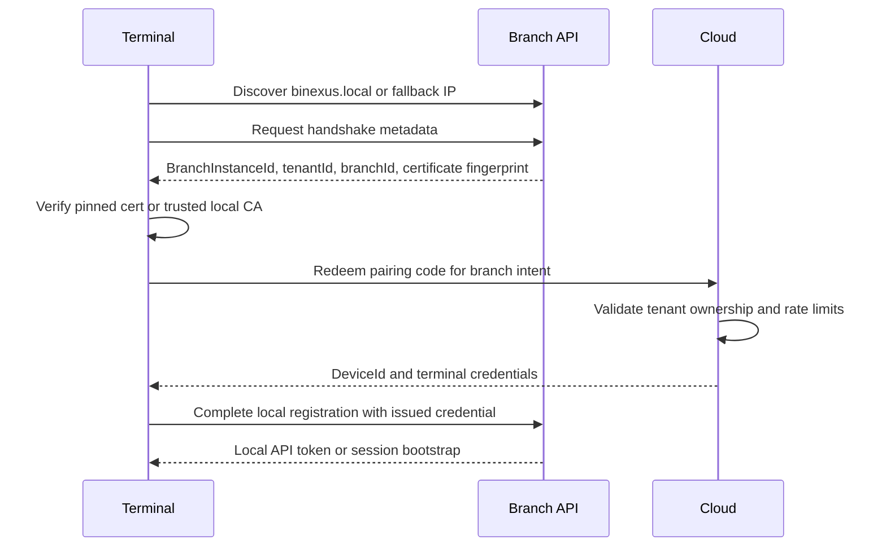

# ADR-0022: Branch device pairing and handshake

| Field    | Value                                      |
| -------- | ------------------------------------------ |
| Status   | Proposed                                   |
| Date     | 2026-07-12                                 |
| Deciders | Kevin Esquivel                             |
| Tags     | branch, pairing, security, identity, local |

## Context and problem statement

Binexus needs a secure way to attach a branch runtime and local terminals to a tenant-owned branch. A branch server must not join a tenant because somebody knows a weak code, and a cashier terminal must not trust any process that answers on the LAN. Pairing creates device identity; it does not authenticate a human user.

Cloud owns tenant and branch metadata, so Cloud validates the intent to pair a device to a branch. Branch owns in-person operation after pairing, so the branch backend remains the operational authority for POS, warehouse, and logistics work. Terminals never write PostgreSQL directly; they talk to the branch API after a handshake.

**Question:** how do devices pair, prove local trust, and reconnect without giving LAN devices permanent shared secrets?

## Decision drivers

- **Tenant ownership** - Cloud must confirm that the tenant owns the target branch before issuing device credentials.
- **Short exposure window** - A pairing artifact must expire quickly, work once, and withstand guessing attempts.
- **Permanent device identity** - Runtime components need stable `DeviceId` and `BranchInstanceId` values after pairing.
- **Local authority** - Branch backend authorizes in-person work after setup; Cloud does not participate in the sale path.
- **Revocation** - Operators need a way to revoke a lost terminal or compromised branch instance.
- **No blind LAN trust** - Discovery finds candidates, but handshake verifies identity before the terminal sends credentials or user tokens.

## Considered options

1. **Temporary pairing code with Cloud-issued device credentials** - Cloud validates tenant and branch ownership, then issues durable device identity and credentials.
2. **Permanent shared branch password** - Operators configure one password on the branch server and every terminal.
3. **Open LAN trust after discovery** - Terminals connect to any discovered branch API without cryptographic verification.
4. **QR-only pairing without expiry** - A QR code contains all terminal bootstrap data and remains valid until rotated manually.

## Decision outcome

**Chosen option:** _Temporary pairing code with Cloud-issued device credentials_, because it gives Cloud control over tenant ownership while keeping branch operations local after pairing.

Pairing uses a short-lived, single-use, rate-limited code or equivalent bootstrap artifact. Cloud validates that the authenticated tenant can pair devices for the selected branch. On success, Cloud emits permanent identifiers and credentials:

- `DeviceId` for the pairing subject.
- `BranchInstanceId` for the installed branch runtime.
- Credentials, certificates, or tokens needed for local handshake and future sync.
- Metadata that binds the credential to tenant, branch, runtime role, and expiry or rotation policy.

The branch server stores its own credential material in the OS secret store. A terminal stores only terminal-scoped credentials. Pairing does not create a user session; users still authenticate through the branch Identity module.

### Handshake sequence after discovery

Branch server installation may run a related Cloud pairing step before terminals join it. Secondary cashier terminals discover and handshake with the already paired branch server over LAN.

### Revocation path

Cloud records active branch instances and paired devices. A tenant admin can revoke a `DeviceId` or `BranchInstanceId`. Revocation reaches the branch through downstream sync when Cloud connectivity exists. Branch applies the revocation locally and rejects future handshakes or refreshes from the revoked credential. If Cloud stays unreachable, already accepted local credentials keep the branch operational until local policy expires or an administrator revokes them on the branch server.

### Positive consequences

- Pairing proves tenant ownership before any device receives durable credentials.
- A stolen pairing code has limited value because it expires, works once, and hits rate limits.
- Device identity survives reboot, DNS changes, and terminal relabeling.
- Revocation has a named path for lost terminals and compromised installs.
- Terminals verify the branch server before sending login credentials or accepting local tokens.

### Negative consequences

- Initial pairing requires Cloud connectivity.
- Certificate and credential lifecycle become part of branch operations.
- Operators need UX that explains the difference between pairing a device and signing in a user.

### Trade-offs accepted

- Binexus accepts setup complexity to avoid a permanent LAN password.
- Binexus accepts eventual revocation delivery during Cloud outages because branch continuity matters more than immediate Cloud enforcement for in-person work.
- Binexus keeps QR codes as a transport for pairing material only when they carry expiry and single-use semantics.

## Pros and cons of the options

### Option 1 - Temporary pairing code with Cloud-issued device credentials

- **Good:** Cloud validates tenant ownership before issuing identity.
- **Good:** Single-use, short-lived artifacts reduce damage from screenshots and shoulder surfing.
- **Good:** Durable `DeviceId` and `BranchInstanceId` support audit, revocation, sync, and support diagnostics.
- **Bad:** Setup needs Cloud connectivity.
- **Bad:** Requires certificate or token rotation design.

### Option 2 - Permanent shared branch password

- **Good:** Easy to explain and implement.
- **Bad:** One leaked password compromises every terminal.
- **Bad:** No per-device audit or revocation.
- **Bad:** Operators tend to reuse or print shared passwords.

### Option 3 - Open LAN trust after discovery

- **Good:** Fastest local connection path.
- **Bad:** Any malicious service on the subnet can impersonate the branch API.
- **Bad:** Violates the rule that terminals must not trust LAN discovery alone.

### Option 4 - QR-only pairing without expiry

- **Good:** Convenient for installers.
- **Bad:** A photo of the QR code remains a credential forever.
- **Bad:** No rate limiting, replay protection, or meaningful revocation boundary.

## Validation

This decision is working if:

- Pairing codes expire, work once, and enforce rate limits per tenant, branch, and requester.
- Cloud refuses pairing when the authenticated tenant does not own the target branch.
- A paired terminal receives a stable `DeviceId` and never receives direct PostgreSQL credentials.
- The branch API rejects a terminal that cannot prove possession of its issued credential.
- Revoking a device prevents future local handshake or token refresh after the branch receives the revocation.

It is failing if:

- A terminal can join a branch by knowing only an 8-character code.
- A terminal sends user credentials to an unverified LAN endpoint.
- A shared password grants access to more than one device.
- A QR code works indefinitely.

## More information

- Related ADRs: [ADR-0003](0003-offline-first-design.md), [ADR-0006](0006-authentication-jwt-argon2-rbac.md), [ADR-0023](0023-branch-installation.md), [ADR-0024](0024-local-http-api.md), [ADR-0025](0025-local-authentication.md)
