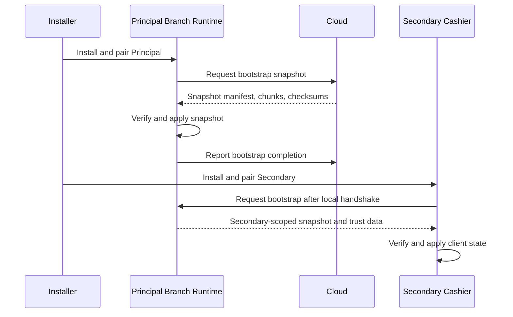

# ADR-0029: Branch Runtime bootstrap snapshot

| Field    | Value                                              |
| -------- | -------------------------------------------------- |
| Status   | Proposed                                           |
| Date     | 2026-07-12                                         |
| Deciders | Kevin Esquivel                                     |
| Tags     | branch, bootstrap, sync, installation, credentials |

## Context and problem statement

After installation and pairing, a Branch Runtime needs enough local data to operate without depending on a live Cloud request. The first paired Principal needs tenant, branch, identity, feature, catalog, and trust material before it can serve local users. A Secondary cashier needs a usable local client state, but it must not bypass the Principal when a Principal exists.

ADR-0022 defines pairing and handshake. ADR-0023 defines Principal and Secondary installation roles. ADR-0027 defines ongoing synchronization. Bootstrap fills the gap between pairing and steady-state sync.

**Question:** which component supplies the first local snapshot, what must the snapshot include, and how should Binexus handle interrupted bootstrap?

## Decision drivers

- **Operational readiness** - A newly paired runtime must have enough data to authenticate users and enforce branch policy.
- **Principal authority** - Secondary cashiers must use the Principal as their branch source when a Principal exists.
- **Controlled data size** - Bootstrap should include branch-relevant data, not the entire tenant corpus.
- **Trust establishment** - Runtime components need certificates or trust anchors before accepting local traffic.
- **Recoverable setup** - Installers need progress, resume, checksums, failure states, and retry.
- **No empty domain database** - A Secondary must not invent a local domain database when the Principal has branch authority.

## Considered options

1. **Role-based bootstrap snapshot** - Principal bootstraps from Cloud, and Secondary bootstraps from Principal after pairing and handshake.
2. **Every device bootstraps directly from Cloud** - Principal and Secondary devices pull their first snapshot from Cloud.
3. **Secondary creates an empty local domain database** - Secondary starts with local storage and syncs later.
4. **Manual export and import package** - Operators move a bootstrap archive between Cloud, Principal, and Secondary.

## Decision outcome

**Chosen option:** _Role-based bootstrap snapshot_, because Principal owns branch authority and Secondary devices should not create competing local state.

The first paired Principal after install pulls a bootstrap snapshot from Cloud. The first paired Secondary after install pulls its bootstrap snapshot from the Principal, not directly from Cloud when a Principal exists. A Secondary may contact Cloud only for pairing intent, credential issuance, revocation status, or recovery flows that explicitly handle a missing Principal.

### Bootstrap contents

| Category                       | Included data                                                                                                      | Reason                                                                    |
| ------------------------------ | ------------------------------------------------------------------------------------------------------------------ | ------------------------------------------------------------------------- |
| Users and roles                | Branch-assigned users, role grants, password hashes or local authentication material allowed by ADR-0025           | Local sign-in and authorization need this data before Cloud is reachable. |
| Feature flags                  | Tenant and branch feature state, including local kill-switch overrides when applicable                             | Runtime composition and UI need branch policy.                            |
| Catalog subset                 | Branch-relevant products, units, taxes, prices, promotions, and required lookup data                               | POS and warehouse operations need a bounded catalog.                      |
| Branch configuration           | Tenant id, branch id, branch display data, runtime mode, local endpoints, device policy, sync stream metadata      | Runtime services need stable identity and local behavior.                 |
| Certificates and trust anchors | Branch certificates, trusted local CA material, Cloud trust anchors, and pinned identities as required by ADR-0022 | Devices need verified local and Cloud communication.                      |

Bootstrap does not include Cloud admin credentials, full tenant data unrelated to the branch, raw card PAN, or long-lived personal access tokens.

### Bootstrap flow

### Progress, resume, checksums, and retry

Bootstrap uses a manifest with snapshot id, stream versions, chunk ids, byte sizes, checksums, and minimum runtime version. The receiving runtime records progress after each verified chunk and after each applied section. If setup fails, the runtime resumes from the last verified checkpoint or discards the partial snapshot when the manifest changes.

Checksum failure stops bootstrap for that chunk and retries the chunk. Repeated checksum failure marks bootstrap failed and exposes the failure to the installer UI. Transient network errors use bounded backoff and resume. Permanent authorization or version errors stop bootstrap until the installer fixes pairing, runtime version, or branch assignment.

### Positive consequences

- Principal starts with the data required for local authentication and operations.
- Secondary devices depend on the Principal for branch data and avoid competing domain stores.
- Bootstrap can resume after network loss or machine restart.
- Checksums protect installers from partially applied snapshots.
- Snapshot scope limits data exposure on branch devices.

### Negative consequences

- Cloud needs a bootstrap snapshot endpoint for Principal installs.
- Principal needs a Secondary bootstrap endpoint and snapshot builder.
- Installers need UX for progress, retry, and failure states.
- Snapshot schema evolution needs version compatibility rules.

### Trade-offs accepted

- Binexus accepts a larger install-time workflow to avoid ad hoc first-run sync.
- Binexus accepts Principal dependency for Secondary bootstrap because it preserves branch authority.
- Binexus accepts a bounded catalog subset instead of full tenant bootstrap.

## Pros and cons of the options

### Option 1 - Role-based bootstrap snapshot

- **Good:** Aligns with Principal and Secondary roles in ADR-0023.
- **Good:** Gives Principal enough data to operate locally after Cloud disappears.
- **Good:** Keeps Secondary devices from creating local domain authority.
- **Good:** Supports progress, resume, checksums, and retries.
- **Bad:** Requires separate Cloud and Principal bootstrap surfaces.
- **Bad:** Requires snapshot versioning and chunk integrity checks.

### Option 2 - Every device bootstraps directly from Cloud

- **Good:** Simplifies Cloud visibility into device setup.
- **Bad:** A Secondary can bypass the Principal as branch data source.
- **Bad:** Secondary setup becomes dependent on Cloud even when the Principal is healthy.
- **Bad:** Duplicates branch data distribution paths.

### Option 3 - Secondary creates an empty local domain database

- **Good:** Secondary can start without waiting for Principal bootstrap data.
- **Bad:** Creates a second local domain state inside the branch.
- **Bad:** Forces peer or Cloud merge for stock, cash, and sales.
- **Bad:** Violates the installation topology in ADR-0023.

### Option 4 - Manual export and import package

- **Good:** Can work when connectivity is unavailable during installation.
- **Bad:** Increases operator error and support burden.
- **Bad:** Makes credential and trust material handling harder to audit.
- **Bad:** Weak fit for normal guided installation.

## Validation

This decision is working if:

- A newly paired Principal receives users, roles, feature flags, catalog subset, branch config, certificates, and trust anchors before serving branch operations.
- A Secondary with a reachable Principal bootstraps from the Principal instead of Cloud.
- Bootstrap can resume after interruption without duplicating or corrupting applied data.
- Checksum failure stops the affected chunk and reports a clear installer error.
- A Secondary cannot create an empty local domain database for branch sales, stock, or cash.

It is failing if:

- A Secondary needs direct Cloud bootstrap while the Principal is healthy.
- A Principal reaches local sign-in without required users and roles.
- Bootstrap restarts from zero after every network failure.
- Partial snapshot data becomes active after checksum failure.

## More information

- Related ADRs: [ADR-0022](0022-pairing-and-handshake.md), [ADR-0023](0023-branch-installation.md), [ADR-0025](0025-local-authentication.md), [ADR-0027](0027-synchronization-architecture.md), [ADR-0030](0030-configuration-storage.md), [ADR-0031](0031-secrets-storage.md)
