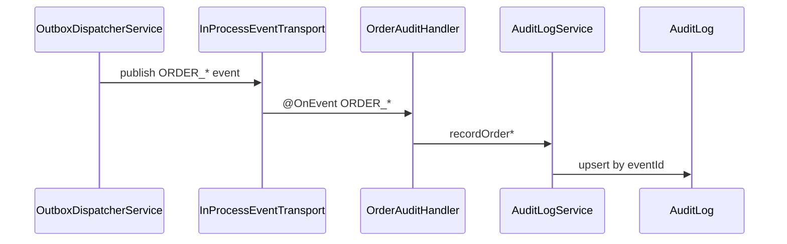

# Audit log

## Purpose

Provide an immutable, tenant-scoped trail of significant domain facts. Orders events are the first active consumers so every commercial state change leaves an idempotent audit row.

## Model

`AuditLog` in [`apps/backend/prisma/schema.prisma`](../../apps/backend/prisma/schema.prisma):

| Field         | Role                                             |
| ------------- | ------------------------------------------------ |
| `eventId`     | Unique — idempotent across dispatcher retries    |
| `eventName`   | Domain event name (e.g. `ORDER_CREATED`)         |
| `tenantId`    | Tenant scope                                     |
| `actorUserId` | Who caused the action, when known                |
| `entityType`  | Aggregate type (`Order`, `User`, …)              |
| `entityId`    | Aggregate id                                     |
| `action`      | Verb or event name for filtering                 |
| `payload`     | Minimal JSON snapshot from the event             |
| `occurredAt`  | When the fact happened (from the event envelope) |

## Flow

## Idempotency

`AuditLogService` uses `upsert` on `eventId`. If the dispatcher retries a publish, the audit row is not duplicated.

## Code locations

| Piece                        | Path                                                                                                                                     |
| ---------------------------- | ---------------------------------------------------------------------------------------------------------------------------------------- |
| `AuditLogService`            | [`apps/backend/src/common/audit/audit-log.service.ts`](../../apps/backend/src/common/audit/audit-log.service.ts)                         |
| `OrderCreatedAuditHandler`   | [`apps/backend/src/common/audit/order-created-audit.handler.ts`](../../apps/backend/src/common/audit/order-created-audit.handler.ts)     |
| `OrderApprovedAuditHandler`  | [`apps/backend/src/common/audit/order-approved-audit.handler.ts`](../../apps/backend/src/common/audit/order-approved-audit.handler.ts)   |
| `OrderCancelledAuditHandler` | [`apps/backend/src/common/audit/order-cancelled-audit.handler.ts`](../../apps/backend/src/common/audit/order-cancelled-audit.handler.ts) |
| `AuditModule`                | [`apps/backend/src/common/audit/audit.module.ts`](../../apps/backend/src/common/audit/audit.module.ts)                                   |

## Adding audit for a new event

1. Add a method on `AuditLogService` (or a dedicated handler) that maps the payload to `entityType` / `entityId` / `action`.
2. Register an `@OnEvent('YOUR_EVENT')` handler in `AuditModule`.
3. Use `upsert` on `eventId` for idempotency.
4. Update [`docs/events/README.md`](../events/README.md) consumers column.

## Not in scope yet

- Audit log HTTP API or admin UI
- Retention / archival policies
- Cross-tenant audit search (super-admin tooling)
