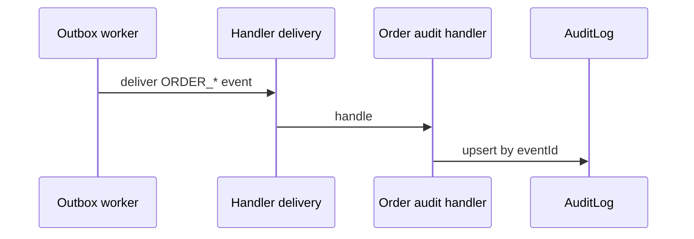

# Audit log

## Purpose

Provide an immutable, tenant-scoped trail of significant domain facts. Orders events are the first active consumers so every commercial state change leaves an idempotent audit row.

**Backend:** C# / .NET 10 / ASP.NET Core / EF Core / PostgreSQL. Nest Prisma `AuditLog` handlers are historical ([ADR-0015](../adr/0015-nestjs-retirement-dotnet-sole-backend.md)).

## Model

`AuditLog` is an EF entity in Platform / Identity persistence (tenant-scoped):

| Field         | Role                                             |
| ------------- | ------------------------------------------------ |
| `eventId`     | Unique — idempotent across dispatcher retries    |
| `eventName`   | Domain event name (e.g. `ORDER_CREATED`)         |
| `tenantId`    | Tenant scope                                     |
| `actorUserId` | Who caused the action, when known                |
| `entityType`  | Aggregate type (`Order`, `User`, …)              |
| `entityId`    | Aggregate id                                     |
| `action`      | Verb or event name for filtering                 |
| `payload`     | Minimal JSON snapshot from the event             |
| `occurredAt`  | When the fact happened (from the event envelope) |

## Flow

## Idempotency

Handlers upsert by `eventId` so outbox redelivery does not duplicate rows.

## Rules

- Audit is a consumer of facts, not a second write path for business state.
- Payloads stay minimal (ids + state deltas), not full aggregate dumps.
