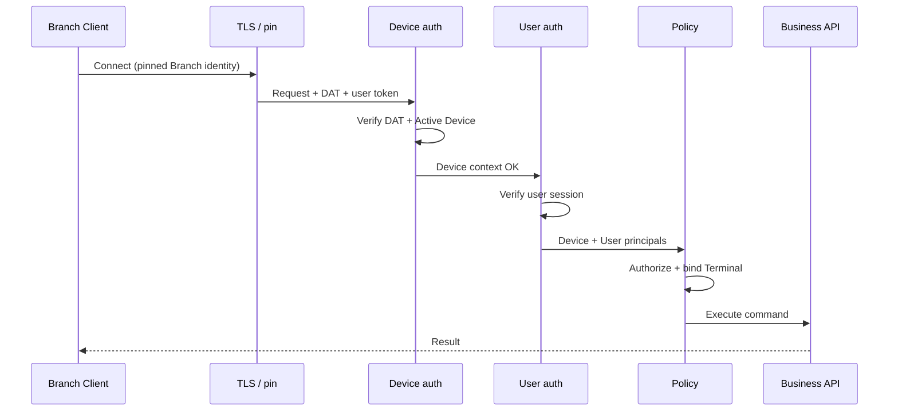

# Branch Runtime operational security model

**Status:** Accepted baseline (architectural parent for Branch Runtime operational security)
**Accepted:** 2026-07-18
**Baseline:** `main` @ `2c95236`
**Audience:** All Branch security initiatives
**Related:** [ADR-0018](../adr/0018-device-terminal-user-identity.md), [ADR-0020](../adr/0020-branch-client-pairing.md), [ADR-0023](../adr/0023-lan-api-security.md), [ADR-0019](../adr/0019-branch-server-activation.md), [branch-runtime.md](./branch-runtime.md), [PLAN — BRANCH DEVICE AUTHENTICATION](../branch-device-auth/PLAN.md)

This document defines the **definitive** Branch Runtime operational security model.
**BRANCH DEVICE AUTHENTICATION** is the first implementation slice of this model — not a one-off for the next feature.

Child initiatives governed by this parent:

```text
BRANCH DEVICE AUTHENTICATION     ← completed (main @ 34f097d / PR #90)
BRANCH USER SESSION              ← next design phase
LAN TLS AND BRANCH SERVER IDENTITY
SALES TERMINAL BINDING
OFFLINE SALES ENGINE
```

ADRs 0018 / 0020 / 0023 remain **Proposed** until product acceptance after their required capabilities land. Device Auth implements the machine factor and interim Dev+User composition; it does **not** flip those ADRs to Accepted. This baseline does not mark them `Accepted`.

No implementation, branch, or commit plan lives here.

---

## 1. Definitive authentication model

### 1.1 Principals and contexts (who / what)

| Concept                                  | Kind              | Meaning                                                                             | Minted / owned by                                                          | Appears on operational requests?                                                               |
| ---------------------------------------- | ----------------- | ----------------------------------------------------------------------------------- | -------------------------------------------------------------------------- | ---------------------------------------------------------------------------------------------- |
| **Tenant**                               | Tenancy           | SaaS customer boundary                                                              | Cloud                                                                      | As claim / DB filter; never a credential by itself                                             |
| **Branch** (`BranchId`)                  | Business location | Sucursal                                                                            | Cloud                                                                      | Bound into BranchInstance at activation; claim/filter                                          |
| **Branch Instance** (`BranchInstanceId`) | Installation      | One active authoritative Postgres + Branch API process for that sucursal            | Branch mints; Cloud adopts (ADR-0017/0019)                                 | Implicit: every Branch API call is against _this_ instance                                     |
| **Device** (`DeviceId`)                  | Machine identity  | Physical/logical client machine (Tauri host) or Principal host device at activation | Pairing (clients) or activation (server host)                              | **Yes** — device proof required for operational LAN APIs                                       |
| **Terminal** (`TerminalId`)              | Workstation role  | Logical caja/oficina role assigned to at most one Active Device                     | Branch at pairing approval                                                 | **Yes as context** — not a separate crypto factor; derived from Active Device→Terminal binding |
| **User** (`UserId`)                      | Human actor       | Operator performing the action                                                      | Cloud provisions; Branch authenticates locally (target) or via interim JWT | **Yes** — user session / access token                                                          |

**Non-negotiable separations (ADR-0018):**

```text
Device  ≠  Terminal  ≠  User
Activation (Branch↔Cloud)  ≠  Pairing (Client↔Branch)
Branch Client device credential  ≠  Branch↔Cloud sync credential
```

### 1.2 API surfaces (what is being called)

| Surface                    | Role                                                               | Trust relationship                                                                              |
| -------------------------- | ------------------------------------------------------------------ | ----------------------------------------------------------------------------------------------- |
| **Health APIs**            | Liveness / instance metadata for ops and probes                    | Mostly unauthenticated or minimally authenticated; never grants business authority              |
| **Pairing APIs (machine)** | Ceremony for a not-yet-trusted or mid-ceremony device              | Ephemeral pairing artifacts + PoP; **not** operational device auth                              |
| **Pairing APIs (admin)**   | Human approval / revoke / list                                     | User (and later Device+User when done from a paired Branch Client)                              |
| **Operational APIs**       | Authoritative sucursal work (Sales, Inventory writes, sessions, …) | **Device + User** (+ Terminal context); TLS identity of Branch Server when LAN TLS is live      |
| **Sales APIs**             | Subset of operational APIs for POS                                 | Same as operational; additionally require resolvable **Active Terminal** for session invariants |
| **Sync APIs (future)**     | Branch Server ↔ Cloud journal/inbox                                | **Installation / sync credential** from activation — **not** Tauri device credentials           |

### 1.3 Target posture (steady state)

```text
Branch Client → Branch Server (LAN):

  Transport:     TLS to Branch Server identity (pinned fingerprint learned at pairing)
  Machine:       Device authentication (proof of Active paired Device)
  Human:         User authentication (Branch-signed user access token after local login)
  Context:       TerminalId from Active Device→Terminal binding (not client-supplied free string)
  Tenancy:       TenantId + BranchId from BranchInstance binding + token claims (must agree)

Branch Server → Cloud (internet):

  Transport:     TLS to Cloud
  Machine/install: Activation / sync credentials (ADR-0019)
  Not used:      Cashier Device credentials
```

### 1.4 Interim posture (allowed until follow-on initiatives land)

| Layer             | Interim (until named initiative)                                                                             | Steady state                                                                |
| ----------------- | ------------------------------------------------------------------------------------------------------------ | --------------------------------------------------------------------------- |
| User factor       | Cloud-shaped user JWT accepted on Branch **only if** Device proof also present on operational routes         | Branch-signed user access token after local login (**BRANCH USER SESSION**) |
| Transport         | HTTP allowed in lab/CI on private LAN                                                                        | TLS + pin (**LAN TLS AND BRANCH SERVER IDENTITY**)                          |
| Terminal on Sales | May still accept legacy string terminals on Cloud; Branch operational Sales must move to `BranchTerminal.Id` | **SALES TERMINAL BINDING**                                                  |
| Sync              | Not present                                                                                                  | Sync credential path separate from device auth                              |

Interim must **never** mean: operational Branch APIs callable with user JWT alone.

---

## 2. Authentication factors in the system

### 2.1 Factor catalog

| Factor                                        | Proves                                           | Lifetime                                 | Storage                                                   | Used by                                                                                     |
| --------------------------------------------- | ------------------------------------------------ | ---------------------------------------- | --------------------------------------------------------- | ------------------------------------------------------------------------------------------- |
| **Branch Server identity**                    | Client talks to the intended Branch Instance     | Cert / fingerprint rotation              | Client: pin from pairing; Server: installer/OS store      | All paired-client TLS sessions                                                              |
| **TLS (LAN)**                                 | Confidentiality + integrity on the wire          | Connection                               | N/A                                                       | Steady-state Client→Branch                                                                  |
| **Certificate pinning**                       | Server identity despite DHCP/IP change           | Until re-pair / pin update               | Client secure store                                       | Steady-state Client→Branch                                                                  |
| **mTLS (future, optional)**                   | Client cert as device proof                      | Cert lifetime                            | Client keystore                                           | Deferred alternative to application-layer device proof; **not required for v1 device auth** |
| **Pairing credentials / artifacts**           | Mid-ceremony legitimacy                          | Short-lived                              | Challenges, status token, receipt (raw once)              | Pairing machine APIs only                                                                   |
| **Device long-term credential**               | Possession of the paired machine secret          | Until revoke/retire/re-pair              | Client: OS secure store (raw); Branch: hash + pubkey only | Issuing / refreshing device proofs; never sent raw on operational APIs if PoP used          |
| **Device authentication (operational proof)** | _This request_ is from an Active Device          | Short-lived token and/or per-request PoP | Client memory / short cache; Branch validates             | Operational (+ Sales) APIs                                                                  |
| **User authentication**                       | _This human_ is who they claim                   | Session / access token TTL               | Client session store; Branch validates                    | Operational + admin pairing; Sales                                                          |
| **User session / access token**               | Authorized human session on this Branch Instance | Minutes–hours; refresh policy TBD        | Bearer token                                              | Together with device proof                                                                  |
| **Operational access**                        | Composite authorization decision                 | Per request                              | Derived                                                   | Business endpoints                                                                          |
| **Branch↔Cloud sync credential**              | This Branch Instance may sync                    | Long-lived; rotatable                    | Branch OS store; Cloud hashed/managed                     | Future Sync APIs only                                                                       |
| **Activation materials**                      | One-time bind Branch↔Cloud                       | Single-use / short                       | Ephemeral                                                 | Activation ceremony only                                                                    |

### 2.2 Chosen v1 device-authentication mechanism (design freeze)

**Application-layer Device Access Token (DAT), bound to Device + BranchInstance, issued after ECDSA PoP using the pairing keypair.**

Rationale:

- Reuses pairing crypto (P-256 + SHA-256) already in production ceremony.
- Avoids blocking on installer-issued client certs / mTLS UX.
- Compatible with later mTLS as an _additional or alternate_ device proof without rewriting tenancy/terminal model.
- Raw long-term device credential stays off the wire on operational calls (aligned with pairing confirm policy).

Normative protocol: [PLAN — BRANCH DEVICE AUTHENTICATION](../branch-device-auth/PLAN.md).

```text
1. Client holds ECDSA keypair (+ raw credential at rest; hash only on Branch).
2. Client POST /branch/device-auth/challenges { deviceId } → challenge (Active devices only).
3. Client signs server-reconstructible canonical PoP with ECDSA private key.
4. Client POST /branch/device-auth/tokens { challengeId, deviceId, signature, protocolVersion }.
   Server loads credentialHash/fingerprint from DB, reconstructs payload, verifies, atomically consumes challenge, issues Branch-signed DAT (HS256 v1).
5. Operational requests:
     Authorization: Bearer <user_access_token>
     X-Binexus-Device-Authorization: Bearer <DAT>
6. Branch validates DAT + Active stamp/status + user token.

No /refresh. No client-supplied credentialHash as a trust factor.
HMAC DAT keys never leave Branch Runtime (holder of key can mint DAT).
```

**Rejected for v1 as sole device factor:** user JWT alone; IP allowlists; mDNS hostname trust; sending long-term credential raw on every request.

**Deferred:** mutual TLS client certificates as the primary device factor; per-request DPoP; asymmetric DAT issuer (claims stay stable).

### 2.3 User factor (design freeze of role, not of issuer)

- **Steady state:** Branch-signed user access token after local authentication against synced credentials (ADR-0023).
- **Interim:** Existing JWT bearer accepted on Branch **only in combination with** valid DAT on operational routes.
- Pairing is **not** a user session.

### 2.4 Terminal is context, not a crypto factor

TerminalId is authorized **by binding**: Active `BranchDevice` → Active `BranchTerminal`.
Clients must not invent terminal strings for Branch operational Sales.
Authorization policy loads Terminal from Device; mismatch ⇒ reject.

---

## 3. Full flow of an operational request

Steady-state logical pipeline (order is normative):

```text
Client process (Tauri)
  │
  ├─ Load pinned Branch Server identity (fingerprint / cert)
  ├─ Open TLS session; verify pin                     [LAN TLS initiative]
  ├─ Load long-term device credential (secure store)
  ├─ Ensure Device Access Token (mint/refresh via PoP)
  ├─ Load user access token (local login / interim JWT)
  │
  ▼
HTTP request to Branch API
  │
  ▼
[1] Transport acceptance
      TLS OK + pin match (when TLS required)
      │
      ▼
[2] Device proof
      Extract DAT / device proof
      Verify crypto + expiry + BranchInstanceId
      │
      ▼
[3] Branch device validation
      Load BranchDevice by DeviceId
      Require Status = Active
      Require not revoked; credential/pubkey still matches DAT binding
      Resolve TerminalId from Active Terminal binding
      Populate ICurrentDevice (+ Terminal context)
      │
      ▼
[4] User session validation
      Validate user access token (issuer, signature, expiry)
      Require TenantId/BranchId consistent with BranchInstance binding
      Populate ICurrentUser / ICurrentTenant
      │
      ▼
[5] Authorization policy
      Endpoint policies: roles, entitlements, Branch-only features
      Device+User required for operational class
      │
      ▼
[6] Terminal context enforcement (Sales and session-scoped ops)
      SalesSession invariant (TenantId, BranchId, TerminalId)
      Terminal must be Active and bound to this Device
      │
      ▼
[7] Business endpoint
      Domain handler (e.g. CreateSale) — no auth reinvented inside modules
```



**Failure modes (fail closed):**

| Step                                    | Typical result                           |
| --------------------------------------- | ---------------------------------------- |
| Bad/missing TLS pin (when required)     | Connection / 401-class transport failure |
| Missing/invalid DAT                     | 401 device                               |
| Device Revoked / PendingConfirmation    | 403 device                               |
| Missing/invalid user token              | 401 user                                 |
| Tenant/Branch mismatch                  | 403 tenancy                              |
| Terminal missing / Disabled / not bound | 403 terminal                             |
| Role insufficient                       | 403 authorization                        |

---

## 4. Route authentication matrix

Legend:

| Code         | Meaning                                                                          |
| ------------ | -------------------------------------------------------------------------------- |
| **Anon**     | No auth                                                                          |
| **Pair**     | Pairing artifacts only (code / status token / receipt / PoP challenge) — not DAT |
| **Dev**      | Valid Device Access Token + Active Device                                        |
| **User**     | Valid user access token                                                          |
| **Dev+User** | Both required                                                                    |
| **TLS\***    | Required in steady state; optional in lab until LAN TLS initiative               |
| **SyncCred** | Branch↔Cloud installation/sync credential                                        |
| **Loopback** | Process-local / installer diagnostics only                                       |

### 4.1 Health

| Route class            | Example                | Auth                                                | TLS\*    | Notes                                                      |
| ---------------------- | ---------------------- | --------------------------------------------------- | -------- | ---------------------------------------------------------- |
| Process liveness       | `/health`, basic alive | Anon                                                | No       | No tenancy; no business data                               |
| Runtime descriptor     | `/health/runtime`      | Anon or Dev (TBD minimal)                           | No       | Mode/version only; no secrets                              |
| Branch instance health | `/health/branch`       | Anon today → **prefer Dev** for rich metadata later | Optional | Must not leak pairing secrets; rich fields may require Dev |

**Rule:** Health never substitutes for operational auth. Discovery helpers may stay Anon; anything that exposes inventory of devices/terminals requires User (admin) or Dev+User.

### 4.2 Pairing — machine (Branch Client ceremony)

| Route class               | Auth                        | TLS\*        | Notes                                           |
| ------------------------- | --------------------------- | ------------ | ----------------------------------------------- |
| Create exchange challenge | Anon + Pair (code fields)   | Optional→Yes | Rate-limited; anti-oracle                       |
| Exchange                  | Anon + Pair (PoP)           | Optional→Yes |                                                 |
| Status poll               | Anon + Pair (status token)  | Optional→Yes |                                                 |
| Confirm                   | Anon + Pair (receipt + PoP) | Optional→Yes | Establishes Device; does not issue user session |
| Reissue / resume paths    | Anon + Pair                 | Optional→Yes | Same class                                      |

**Rule:** Machine pairing routes **must not** require DAT (device is not Active yet or is mid-ceremony). After Active, re-auth to operational APIs uses DAT — not pairing receipts.

### 4.3 Pairing / device admin

| Route class                | Auth (interim) | Auth (steady, from Tauri) | TLS\* |
| -------------------------- | -------------- | ------------------------- | ----- |
| Create pairing session     | User           | Dev+User                  | Yes   |
| Get/approve/reject request | User           | Dev+User                  | Yes   |
| List devices / terminals   | User           | Dev+User                  | Yes   |
| Revoke device              | User           | Dev+User                  | Yes   |

**Rule:** Admin pairing from Web Admin talks to **Cloud** (out of this matrix). Admin actions **on Branch API** from a cashier/principal desktop are Branch Client calls → Dev+User in steady state. Interim User-only on Branch admin pairing is acceptable **only** on operator channels already trusted (e.g. local debug with Cloud JWT); product Tauri must move to Dev+User.

### 4.4 Device authentication control plane (new with BRANCH DEVICE AUTHENTICATION)

| Route class                  | Auth                                                            | TLS\* | Notes                                                                         |
| ---------------------------- | --------------------------------------------------------------- | ----- | ----------------------------------------------------------------------------- |
| Device challenge / DAT issue | Pairing-grade PoP with long-term device key (**not** Anon open) | Yes\* | Only for known DeviceId + matching pubkey; PendingConfirmation may be limited |
| Device token refresh         | Dev (or PoP)                                                    | Yes\* |                                                                               |
| Device “whoami” probe        | Dev or Dev+User                                                 | Yes\* | DoD probe for the initiative                                                  |

### 4.5 Operational APIs (general)

| Route class                                           | Auth            | TLS\* | Terminal context        |
| ----------------------------------------------------- | --------------- | ----- | ----------------------- |
| Reads/writes that change or expose sucursal authority | **Dev+User**    | Yes   | As required by resource |
| Branch-only diagnostics beyond health                 | Dev or Dev+User | Yes   |                         |

**Rule:** In Branch mode, **no operational business API is User-only.**

### 4.6 Sales APIs

| Route class                                      | Auth         | TLS\* | Terminal                                       |
| ------------------------------------------------ | ------------ | ----- | ---------------------------------------------- |
| Open/close cash session, CreateSale, adjustments | **Dev+User** | Yes   | **Required** — Active Terminal bound to Device |
| Sales admin/reporting on Branch (if any)         | Dev+User     | Yes   | Policy-specific                                |

**Cloud Sales** (Web → Cloud) remain User (+ Cloud policies) and are outside Branch LAN device auth.

### 4.7 Sync APIs (future)

| Route class                           | Auth                                                                      | TLS\*              | Notes                                        |
| ------------------------------------- | ------------------------------------------------------------------------- | ------------------ | -------------------------------------------- |
| Upstream journal push / ack           | **SyncCred**                                                              | Yes (internet TLS) | Branch Server worker, not Tauri              |
| Downstream inbox pull                 | **SyncCred**                                                              | Yes                |                                              |
| Client-triggered “sync now” (if ever) | Dev+User on Branch, which enqueues work; **wire to Cloud still SyncCred** | Yes                | Never send cashier DAT to Cloud as sync auth |

### 4.8 Activation APIs

| Route class                      | Auth                 | Notes                                 |
| -------------------------------- | -------------------- | ------------------------------------- |
| Activation ceremony Branch↔Cloud | Activation materials | Separate trust domain; no cashier DAT |

### 4.9 Summary matrix

```text
                    Anon   Pair   Dev   User   Dev+User   SyncCred   TLS*
Health liveness      ✓                                      (lab)
Health rich                         ✓*            ✓*         ✓*
Pairing machine             ✓                                 ✓*
Pairing admin                              ✓†      ✓‡         ✓*
DAT issue / refresh         ✓§     ✓                          ✓*
Operational                                    ✓              ✓*
Sales                                          ✓   +Terminal  ✓*
Sync (Branch↔Cloud)                                     ✓     ✓
Activation          (activation materials only)

* steady state
† interim on Branch admin
‡ steady state from paired client
§ PoP with long-term device key / known DeviceId — not open Anon
```

---

## 5. Compatibility with future capabilities

| Capability                 | Compatible? | How this model supports it                                                                                             |
| -------------------------- | ----------- | ---------------------------------------------------------------------------------------------------------------------- |
| **Offline Sales**          | Yes         | CreateSale is operational: Dev+User+Terminal; authority remains Branch Postgres commit                                 |
| **Sync**                   | Yes         | Separate SyncCred channel; device auth does not conflate with journal identity                                         |
| **Revocation**             | Yes         | Device Status=Revoked fails step [3]; DAT must not validate for revoked devices; list/revoke admin stays User/Dev+User |
| **Multi-terminal**         | Yes         | One Active Terminal per Device; multiple Devices; sessions keyed by TerminalId                                         |
| **LAN TLS + pinning**      | Yes         | Transport layer below DAT; pin stored at pairing; device auth unchanged                                                |
| **Branch User Session**    | Yes         | Replaces interim user JWT issuer; pipeline step [4] stays; Dev factor unchanged                                        |
| **Installers**             | Yes         | Installer provisions server cert + firewall; issues Branch Server identity, not cashier DAT                            |
| **Future POS UI**          | Yes         | UI gathers cart; Rust attaches DAT+user; no business auth in React                                                     |
| **Cloud interoperability** | Yes         | Cloud never trusts cashier DAT; sync and activation use installation credentials; Web Admin ≠ Branch LAN               |

**Design invariant for implementers:** do not put Device Access Token validation inside Sales domain handlers. Keep it in Platform auth middleware so Inventory, Logistics, etc. inherit the same gate.

---

## 6. ADR coverage: satisfied vs pending

### ADR-0018 — Device, Terminal, User identity

| Decision element                          | With this security model + DEVICE AUTH initiative            | Still pending                                                                   |
| ----------------------------------------- | ------------------------------------------------------------ | ------------------------------------------------------------------------------- |
| Distinct Device / Terminal / User         | **Satisfied in model**; Device principal appears on requests | Terminal binding into SalesSession strings → Guids (**SALES TERMINAL BINDING**) |
| BranchInstance / Tenant binding           | **Satisfied in model** (validation rules)                    | Already largely present from activation                                         |
| SalesSession `(Tenant, Branch, Terminal)` | **Model requires Terminal context**                          | Enforcement in Sales module                                                     |
| Ownership / sync matrix                   | Unaffected directly                                          | Sync initiatives                                                                |
| Status Accepted                           | No — ADR remains Proposed until product accepts              | Explicit ADR acceptance pass                                                    |

### ADR-0020 — Branch Client pairing

| Decision element                                                       | Satisfied                          | Pending                                   |
| ---------------------------------------------------------------------- | ---------------------------------- | ----------------------------------------- |
| Pairing distinct from activation                                       | Yes (shipped)                      | —                                         |
| DeviceId + credential issued                                           | Yes (shipped)                      | —                                         |
| Terminal assignment                                                    | Yes (shipped)                      | —                                         |
| **Client authenticates API calls with device credential + user token** | **Model + DEVICE AUTH initiative** | Implementation of DAT path                |
| Revocation path                                                        | Partial (revoke APIs exist)        | Sync of revocation to Cloud; UX workflows |
| mDNS discovery / fingerprint UX polish                                 | —                                  | Discovery / LAN TLS initiatives           |
| Status Accepted                                                        | Not yet                            | Needs TLS + operational auth landed       |

### ADR-0023 — LAN API security

| Decision element                                  | Satisfied by this design freeze      | Pending initiative                                      |
| ------------------------------------------------- | ------------------------------------ | ------------------------------------------------------- |
| Reject unknown LAN host without device credential | **Yes (model + DEVICE AUTH)**        | Implementation                                          |
| Device credential + user token                    | **Yes (model)**                      | DEVICE AUTH + USER SESSION                              |
| TLS required for paired clients                   | **Yes (model)**                      | **LAN TLS AND BRANCH SERVER IDENTITY**                  |
| Certificate pin                                   | **Yes (model)**                      | LAN TLS                                                 |
| Bind address / firewall                           | Model acknowledges                   | Installer                                               |
| Branch-signed user token                          | **Yes (model)**                      | **BRANCH USER SESSION**                                 |
| Rotation / revocation                             | **Yes (model)**                      | Device auth refresh + revocation workflows              |
| MinDesktopVersion                                 | Model slot reserved                  | Version gates initiative                                |
| mTLS via enterprise PKI                           | Explicitly **deferred** (alt factor) | Optional later                                          |
| Status Accepted                                   | Not yet                              | After TLS + user session + device auth exist in product |

---

## 7. What BRANCH DEVICE AUTHENTICATION implements vs defers

### Implements (first security capability)

- DAT (or equivalent PoP) issue/validate path.
- `ICurrentDevice` (+ Terminal resolution from binding).
- Branch-mode policy: operational class and Sales class require Dev+User (User may still be interim JWT).
- Desktop attaches device proof on operational HTTP.
- Tests for Active / missing / revoked / wrong-instance.
- Control-plane probe proving enforcement.

### Explicitly does **not** implement (still governed by this document)

- Full LAN TLS + pin enforcement.
- Branch-signed user sessions / local PIN login.
- Sales TerminalId type migration.
- SyncCred APIs.
- mTLS as primary factor.
- POS UI / Offline Sales Engine product surface.

---

## 8. Design freeze decisions (Phase 1 closed for architecture)

1. **Dual factor on operational Branch APIs:** Device + User (Terminal as bound context).
2. **v1 device factor:** application-layer Device Access Token via ECDSA PoP; not mTLS-primary.
3. **Pairing machine routes:** remain Pair-class; never require DAT.
4. **Sync:** never uses cashier DAT.
5. **Interim user JWT:** allowed only together with DAT on operational routes.
6. **Health:** liveness may stay Anon; must not grant business authority.
7. **This document** is the parent model; capability PLANs implement slices without inventing parallel auth stories.

---

## 9. Next step after acceptance of this design

1. Human acceptance of this document as the Branch Runtime operational security baseline.
2. Only then open `feat/branch-device-auth` and implement against §§2.2, 3, 4.4–4.6, 7.
3. Follow-on PLANs remain: **BRANCH USER SESSION**, **LAN TLS AND BRANCH SERVER IDENTITY**, **SALES TERMINAL BINDING**, **OFFLINE SALES ENGINE**.

Until step 1 is explicit, no implementation branch.
