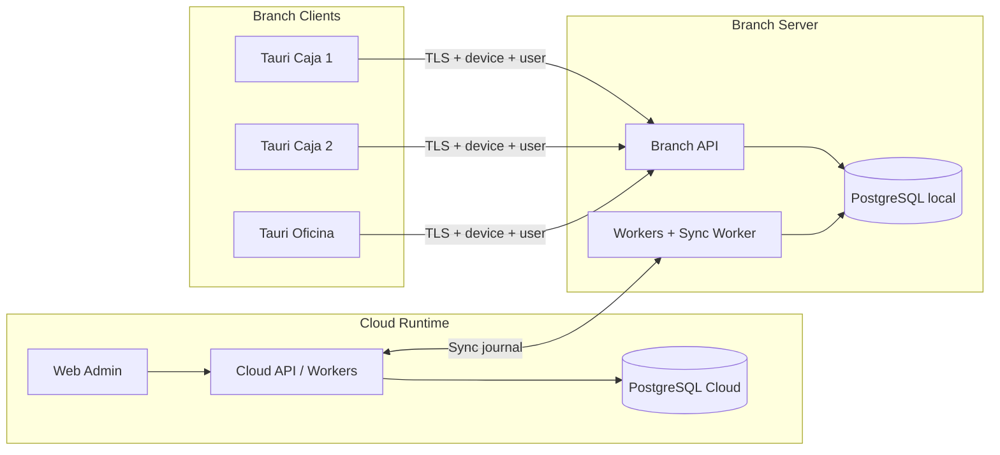

# Branch Runtime architecture

Branch Runtime is the local-hub topology: one Branch Server per sucursal, Branch Clients on LAN, async sync with Cloud Runtime.

Related decisions: [ADR-0016](../adr/0016-three-installation-modes.md) through [ADR-0032](../adr/0032-web-admin-synced-freshness.md). Checkpoint: [branch-runtime-architecture-checkpoint.md](../migration/branch-runtime-architecture-checkpoint.md). Roadmap: [branch-runtime-roadmap.md](./branch-runtime-roadmap.md).

## Three installation modes

```text
Cloud Runtime     → .NET API + Workers + PostgreSQL Cloud
Branch Server     → .NET Branch API + Workers + Sync Worker + PostgreSQL local
Branch Client     → Tauri Desktop only (LAN HTTP to Branch Server)
```

Do not call Branch Server and Branch Client the same "modo local".

## System context



## Offline-first boundary

| Failure                   | Effect                                             |
| ------------------------- | -------------------------------------------------- |
| Internet to Cloud down    | Sucursal keeps operating on Branch Server          |
| LAN to Branch Server down | Branch Client cannot confirm new authoritative ops |

Confirmed sale = Branch Server PostgreSQL commit. Per-terminal isolated confirmed sales are out of scope (future ADR).

## Authority

```text
one sucursal → one active BranchInstance → one authoritative PostgreSQL
```

Local multi-node HA is out of scope. Hardware replace uses Cloud Replace + restore (ADR-0017, ADR-0030).

## Sync design (no entity flags)

```text
commit → event → Sync Journal → batch → peer Inbox → idempotent apply → checkpoint
```

Runtime Outbox, Sync Journal, Inbox, and Checkpoint are distinct concepts (ADR-0025).

## Activation vs pairing

| Flow       | Link                                     |
| ---------- | ---------------------------------------- |
| Activation | Branch Server ↔ Cloud (ADR-0019)         |
| Pairing    | Branch Client ↔ Branch Server (ADR-0020) |

## Installer boundary

Binexus Branch Installer provisions Postgres and Windows Services. Tauri invokes it and shows progress; Rust is not the provisioning engine (ADR-0022).
