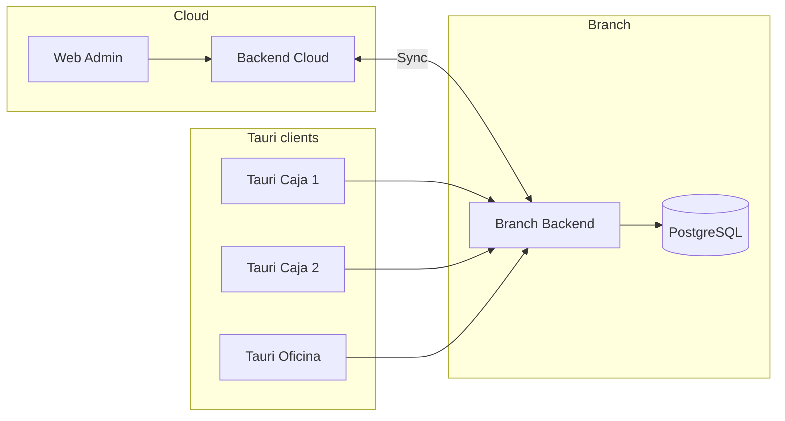
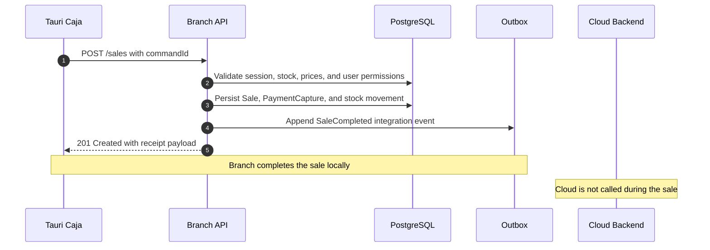
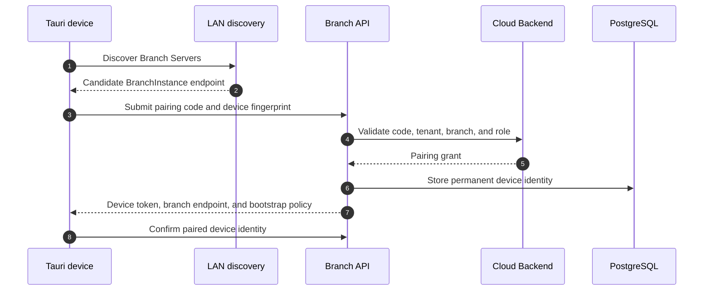
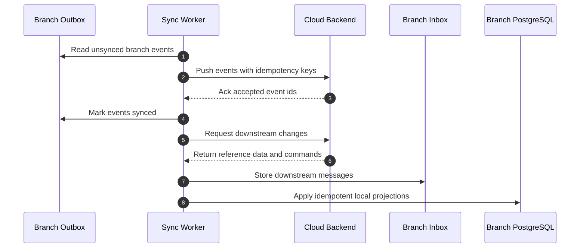

# Branch Runtime architecture

`Branch Runtime` is the local-hub topology that lets a tenant branch keep selling and operating through a local .NET backend, local PostgreSQL, and LAN-connected Tauri clients.

Related decisions:

- [ADR-0003: Offline-first by design](../adr/0003-offline-first-design.md)
- [ADR-0016: Runtime modes for Cloud and Branch](../adr/0016-runtime-modes-cloud-vs-branch.md)
- [ADR-0017: Branch runtime responsibilities](../adr/0017-branch-runtime.md)
- [ADR-0018: Branch Server per sucursal](../adr/0018-branch-server.md)
- [ADR-0019: Device identity for Branch and Tauri hosts](../adr/0019-device-identity.md)
- [ADR-0020: Terminal identity as a logical POS role](../adr/0020-terminal-identity.md)
- [ADR-0021: LAN discovery for Branch Server](../adr/0021-lan-discovery.md)
- [ADR-0022: Branch device pairing and handshake](../adr/0022-pairing-and-handshake.md)
- [ADR-0023: Branch installation topology](../adr/0023-branch-installation.md)
- [ADR-0024: Branch local HTTP API](../adr/0024-local-http-api.md)
- [ADR-0025: Branch local authentication](../adr/0025-local-authentication.md)
- [ADR-0026: Offline-first strategy for Branch Runtime](../adr/0026-offline-first-strategy.md)
- [ADR-0027: Branch and Cloud synchronization architecture](../adr/0027-synchronization-architecture.md)
- [ADR-0028: Branch Runtime conflict resolution](../adr/0028-conflict-resolution.md)
- [ADR-0029: Branch Runtime bootstrap snapshot](../adr/0029-bootstrap.md)
- [ADR-0030: Branch Runtime configuration storage](../adr/0030-configuration-storage.md)
- [ADR-0031: Branch Runtime secrets storage](../adr/0031-secrets-storage.md)
- [ADR-0032: Branch Runtime Windows Service deployment](../adr/0032-windows-service-deployment.md)

## Identity taxonomy

| Concept                  | Meaning                                                           |
| ------------------------ | ----------------------------------------------------------------- |
| Sucursal (Branch)        | Business location; tenant-scoped                                  |
| BranchInstance           | Concrete installed Branch Server + its Postgres for that sucursal |
| Servidor Principal       | Machine running Branch Server Windows Services + Postgres         |
| Caja (Terminal)          | Logical cash register / POS terminal identity                     |
| Dispositivo (Device)     | Paired Tauri machine or the server machine                        |
| Usuario (User)           | Human identity with roles                                         |
| Servidor (Branch Server) | The .NET runtime processes                                        |

`Sucursal` names the business location. `BranchInstance` names the installed runtime for that location. `Servidor Principal` names the physical or virtual Windows machine. `Servidor (Branch Server)` names the .NET processes that run on that machine. The docs must not use these names interchangeably.

## System context



Cloud hosts tenant administration, subscription control, supervision, and synced views. Branch hosts operational writes for the branch. Tauri clients call the Branch Backend on the LAN when the device operates in Branch mode.

## Principal process topology

`Servidor Principal` runs the branch authority for one `BranchInstance`.

| Process                          | Placement                                         | Responsibility                                                                |
| -------------------------------- | ------------------------------------------------- | ----------------------------------------------------------------------------- |
| PostgreSQL                       | Local Windows machine                             | Branch database for operational writes, outbox, inbox, and bootstrap datasets |
| `Binexus.Api` in Branch mode     | Windows Service                                   | HTTP API for Tauri clients and local diagnostics                              |
| `Binexus.Workers` in Branch mode | Windows Service                                   | Outbox, inbox, background jobs, and scheduled local work                      |
| Sync Worker                      | Future worker, likely hosted in `Binexus.Workers` | Upstream event push and downstream dataset pull                               |
| Tauri                            | Optional on the same machine                      | Caja or Oficina UI when the principal machine also serves an operator         |

`Servidor Principal` does not require a browser-based web app for branch operations. It may run Tauri for a local Caja or back-office station.

## Secondary cashier topology

`Caja Secundaria` runs Tauri only.

| Component         | Secondary cashier                            |
| ----------------- | -------------------------------------------- |
| Tauri UI          | Installed                                    |
| Rust host         | Installed for hardware and secure storage    |
| Local PostgreSQL  | Not installed                                |
| Branch API access | HTTPS or HTTP to `Servidor Principal` on LAN |
| Sync worker       | Not installed                                |

Secondary cashiers do not own branch data. They call the Branch API and rely on the principal machine for persistence, idempotency, outbox writes, and sync.

## In-person sale sequence

Cloud is not on the sale path. A branch sale stays available when the internet is down.



## Pairing happy path

Pairing gives a Tauri installation a permanent `Dispositivo` identity and binds it to a `BranchInstance`, `Caja`, or office role.



Cloud participates in pairing because it validates tenant ownership and issues the pairing grant. After pairing, normal branch operations use the Branch API.

## Sync sequence



Upstream sync pushes branch facts to Cloud. Downstream sync pulls tenant-wide reference data, configuration, catalog changes, user grants, and supervision commands into the branch database.

## Composition roots

`BINEXUS_RUNTIME_MODE` selects the runtime composition root.

| Value    | Composition root     | Runtime                    |
| -------- | -------------------- | -------------------------- |
| `Cloud`  | `AddCloudRuntime()`  | Multi-tenant cloud backend |
| `Branch` | `AddBranchRuntime()` | Local branch backend       |

Shared modules keep domain behavior, command handlers, events, validation, EF mappings, and outbox contracts in one implementation. Runtime composition changes hosting, infrastructure bindings, sync policy, and external integrations.

```text
Binexus.Api
  Program.cs
    BINEXUS_RUNTIME_MODE=Cloud  -> AddCloudRuntime()
    BINEXUS_RUNTIME_MODE=Branch -> AddBranchRuntime()

Shared modules
  Identity
  Orders
  Sales
  Inventory
  Warehouse
  Logistics
  Platform messaging
```

Cloud mode may connect to managed services and public ingress. Branch mode binds to local PostgreSQL, LAN HTTP, branch certificates, local diagnostics, and sync jobs.

## Local HTTP API design

Branch API exposes a LAN endpoint for paired Tauri devices.

| Design area             | Direction                                                                                                   |
| ----------------------- | ----------------------------------------------------------------------------------------------------------- |
| Default Branch API port | Use `5102` by default to match the current .NET API convention; allow installer override for port conflicts |
| Worker diagnostics port | Keep `5103` local-only unless a future diagnostics ADR opens it deliberately                                |
| HTTP                    | Allow for first install, diagnostics, and networks where local certificates are not ready                   |
| HTTPS                   | Prefer for paired devices after bootstrap; install or trust a local branch certificate where possible       |
| Certificates            | Branch installer owns local certificate generation, renewal, and trust guidance                             |
| Hostnames               | Support machine name, `.local` discovery name, and manual IP entry                                          |
| Firewall                | Installer creates inbound rules for the Branch API port and limits scope to private LAN profiles            |
| Authentication          | Pairing grants device credentials; normal calls use device identity plus user session                       |
| CORS                    | Allow Tauri app origins only; do not open browser origins by default                                        |

This section describes design intent only. Port numbers, certificate storage, and installer behavior belong in the implementation plan and ADR-0024, ADR-0031, and ADR-0032.

## Discovery with fallbacks

Branch discovery should prefer zero-configuration setup and still work on locked-down LANs.

| Order | Mechanism              | Use                                                                   |
| ----- | ---------------------- | --------------------------------------------------------------------- |
| 1     | mDNS or DNS-SD         | Find Branch Servers on normal LANs                                    |
| 2     | UDP broadcast probe    | Find servers when mDNS is unavailable but broadcast works             |
| 3     | QR code from principal | Transfer endpoint and pairing context without typing                  |
| 4     | Manual host or IP      | Work through restrictive routers and business networks                |
| 5     | Cloud-assisted lookup  | Help when the device can reach Cloud but cannot discover LAN services |

Manual entry must stay first-class. Many target branches use consumer routers, guest Wi-Fi isolation, reused Windows machines, or ad hoc cabling.

## Config, secrets, and PostgreSQL placement

| Data               | Example                                               | Placement                                                         | Notes                                                                       |
| ------------------ | ----------------------------------------------------- | ----------------------------------------------------------------- | --------------------------------------------------------------------------- |
| Runtime config     | `BINEXUS_RUNTIME_MODE`, API port, branch endpoint     | Service environment, installer config, or app settings            | Non-secret operational settings                                             |
| Branch identity    | `BranchInstanceId`, tenant id, branch id              | PostgreSQL plus local config pointer                              | The database stores durable identity; local config points the runtime to it |
| Device identity    | Device id, paired role, Caja id                       | Tauri secure storage and Branch PostgreSQL                        | Tauri stores its credential; Branch stores the paired device record         |
| User session       | Access token, refresh token, role grants              | Tauri secure storage and Identity tables                          | User remains separate from device                                           |
| Secrets            | Signing keys, device credentials, sync credentials    | Windows secret store, DPAPI, or service account protected storage | Do not store in plaintext app settings                                      |
| Operational data   | Sales, stock, orders, routes, outbox, inbox           | Local PostgreSQL on `Servidor Principal`                          | Secondary cashiers do not store this data locally                           |
| Bootstrap datasets | Catalog, users, roles, configuration, branch settings | Local PostgreSQL                                                  | Sync updates these datasets after pairing                                   |

`Servidor Principal` owns the local PostgreSQL instance for the branch. Secondary devices do not create private databases for branch operations.
