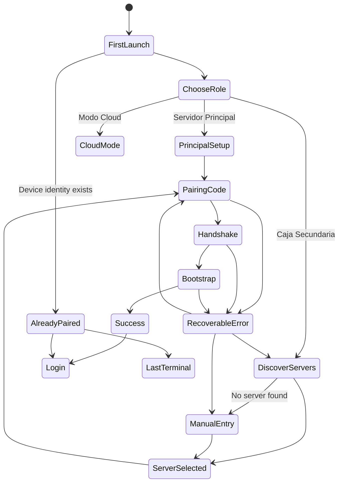

# Branch Wizard UX specification

`Branch Wizard` is the first-run desktop flow that turns an unpaired Tauri installation into a principal server, secondary cashier, or limited cloud client.

Related docs:

- [Branch Runtime architecture](./branch-runtime.md)
- [Desktop Tauri architecture](./desktop-tauri.md)
- [ADR-0021: LAN discovery for Branch Server](../adr/0021-lan-discovery.md)
- [ADR-0022: Branch device pairing and handshake](../adr/0022-pairing-and-handshake.md)
- [ADR-0029: Branch Runtime bootstrap snapshot](../adr/0029-bootstrap.md)
- [ADR-0032: Branch Runtime Windows Service deployment](../adr/0032-windows-service-deployment.md)

This doc specifies UX only. It does not define installer code, API payloads, persistence schema, certificate implementation, or sync internals.

## State model



## Flow 1: Choose role

The first screen asks the operator what this installation should become.

```text
+--------------------------------------------------+
| Binexus Desktop                                  |
| Set up this device                               |
|                                                  |
| [ Servidor Principal ]                           |
| Runs Branch Server, Workers, and PostgreSQL      |
| on this machine.                                 |
|                                                  |
| [ Caja Secundaria ]                              |
| Connects this device to an existing Branch       |
| Server on the LAN.                               |
|                                                  |
| [ Modo Cloud ]                                   |
| Uses the cloud API directly when this branch     |
| does not have a Branch Server. Limited hardware  |
| and offline behavior.                            |
+--------------------------------------------------+
```

| Role                 | Next state      | UX copy                                                                         |
| -------------------- | --------------- | ------------------------------------------------------------------------------- |
| `Servidor Principal` | Principal setup | "This computer will host branch services and local data."                       |
| `Caja Secundaria`    | LAN discovery   | "This device will connect to a Branch Server already installed in this branch." |
| `Modo Cloud`         | Cloud login     | "This mode needs internet and does not provide branch offline continuity."      |

`Modo Cloud` stays available for tenants without branch runtime. The UI labels it as limited so operators do not expect offline POS guarantees.

## Flow 2: Auto-detect Branch Servers on LAN

Discovery starts after the user chooses `Caja Secundaria`.

```text
+--------------------------------------------------+
| Find Branch Server                               |
| Searching this network...                        |
|                                                  |
| Spinner                                          |
|                                                  |
| Found servers                                    |
| (empty until results arrive)                     |
|                                                  |
| [ Enter IP or host manually ]                    |
+--------------------------------------------------+
```

| State           | Behavior                                                                         |
| --------------- | -------------------------------------------------------------------------------- |
| Searching       | Show progress, network name if available, and manual fallback                    |
| Found one       | Select it by default and show host, branch name if known, and certificate status |
| Found many      | Show a selectable list with host, IP, branch label, and last response time       |
| Found none      | Keep retry available and promote manual entry                                    |
| Network blocked | Explain that some routers block discovery and offer manual entry                 |

Discovery results must not pair the device. They only locate a candidate Branch API endpoint.

## Flow 3: Manual IP or host entry

Manual entry handles restrictive networks and failed discovery.

```text
+--------------------------------------------------+
| Connect manually                                 |
| Branch Server address                            |
| [ 192.168.1.20________________ ]                 |
|                                                  |
| Examples: 192.168.1.20, caja-principal.local,    |
| principal.local:5102                             |
|                                                  |
| [ Test connection ] [ Back ]                     |
+--------------------------------------------------+
```

| Input        | Validation                                        |
| ------------ | ------------------------------------------------- |
| IPv4 or IPv6 | Accept local network addresses and optional port  |
| Hostname     | Accept machine name or `.local` name              |
| URL          | Accept `http://` or `https://`; normalize display |
| Empty        | Disable test and continue                         |

The test step reports reachability, TLS status, Branch API version, and whether pairing is enabled.

## Flow 4: Pairing code entry

Pairing proves that the operator has permission to join a branch and receive a permanent device identity.

```text
+--------------------------------------------------+
| Pair this device                                 |
| Enter the code shown in Binexus Admin or on the  |
| Servidor Principal.                              |
|                                                  |
| [ _ _ _ - _ _ _ ]                                |
|                                                  |
| Device role                                      |
| ( ) Caja                                         |
| ( ) Oficina                                      |
|                                                  |
| [ Pair device ]                                  |
+--------------------------------------------------+
```

| Progress state     | Message                                       |
| ------------------ | --------------------------------------------- |
| Validating code    | "Checking pairing code."                      |
| Checking branch    | "Confirming branch and tenant."               |
| Creating identity  | "Creating this device identity."              |
| Saving credentials | "Saving device credentials on this computer." |

Error handling:

| Error                            | UX response                                                                              |
| -------------------------------- | ---------------------------------------------------------------------------------------- |
| Wrong code                       | Keep the user on code entry, clear the code field, and state that the code did not match |
| Expired code                     | Ask the user to generate a new code; preserve the selected Branch Server                 |
| Rate limit                       | Show wait time and disable submit until retry is allowed                                 |
| Cloud unreachable during pairing | Explain that pairing needs Cloud once; offer retry and network diagnostics               |
| Branch unreachable               | Offer retry, rediscovery, and manual host edit                                           |
| Certificate problem              | Show the host, certificate status, and the option to trust through the approved flow     |

## Flow 5: Handshake and bootstrap progress

After pairing succeeds, the device receives bootstrap datasets from the Branch API.

```text
+--------------------------------------------------+
| Preparing this device                            |
|                                                  |
| [x] Device identity                              |
| [x] Branch configuration                         |
| [ ] Users and roles                              |
| [ ] Catalog and prices                           |
| [ ] Inventory snapshot                           |
| [ ] Terminal assignment                          |
|                                                  |
| This can continue if the internet drops after    |
| the Branch Server has the datasets locally.      |
+--------------------------------------------------+
```

| Dataset              | Purpose                                                |
| -------------------- | ------------------------------------------------------ |
| Device identity      | Persist permanent `Dispositivo` credentials            |
| Branch configuration | Bind endpoint, branch id, tenant id, and feature flags |
| Users and roles      | Allow local login and RBAC checks                      |
| Catalog and prices   | Support POS and warehouse flows                        |
| Inventory snapshot   | Support availability and branch stock work             |
| Terminal assignment  | Bind the device to `Caja` or Oficina behavior          |

Bootstrap failure keeps the pairing record unless the Branch API reports that identity creation rolled back. The user can retry bootstrap without retyping the pairing code when the device has a valid partial identity.

## Flow 6: Success and second launch

Success routes the user into the normal app.

```text
+--------------------------------------------------+
| Device ready                                     |
|                                                  |
| Branch: Sucursal Centro                          |
| Device: Caja 2                                   |
| Server: principal.local                          |
|                                                  |
| [ Go to login ]                                  |
+--------------------------------------------------+
```

On second launch, the wizard does not show when the device has a valid paired identity and a reachable configured mode.

| Second launch state                          | Destination                                            |
| -------------------------------------------- | ------------------------------------------------------ |
| Paired Caja                                  | Login, then last terminal or POS home                  |
| Paired Oficina                               | Login, then last office surface                        |
| Paired principal with local services healthy | Login, with diagnostics available                      |
| Paired but Branch API unreachable            | Recovery screen with retry, diagnostics, and host edit |
| Paired but credentials invalid               | Re-pairing screen with preserved endpoint              |

## Flow 7: Error and recovery states

| Failure                          | Recovery screen                   | Primary action              | Secondary action               |
| -------------------------------- | --------------------------------- | --------------------------- | ------------------------------ |
| Wrong code                       | Pairing form with inline error    | Re-enter code               | Back to server selection       |
| Expired code                     | Pairing form with expired message | Enter new code              | Open help text                 |
| Rate limit                       | Locked pairing form               | Wait and retry              | Change server                  |
| Cloud unreachable during pairing | Cloud connectivity error          | Retry                       | Switch network or proxy help   |
| Branch unreachable               | Branch connectivity error         | Retry                       | Rediscover or manual entry     |
| Bootstrap failed                 | Bootstrap recovery                | Retry bootstrap             | View diagnostics               |
| Certificate problems             | Certificate review                | Trust through approved flow | Use HTTP only if policy allows |

Recovery screens must preserve user progress where the system has durable state. They should not erase selected endpoints, device role, or partial bootstrap progress unless the user chooses reset.

## Flow 8: Already paired device

An already paired device starts in a short validation state.

```text
+--------------------------------------------------+
| Opening Binexus                                  |
| Checking device identity and Branch Server...    |
+--------------------------------------------------+
```

| Check                    | Success                            | Failure                          |
| ------------------------ | ---------------------------------- | -------------------------------- |
| Device credential exists | Continue                           | Open first-run wizard            |
| Branch endpoint exists   | Continue                           | Open host recovery               |
| Branch API reachable     | Continue                           | Show branch unreachable recovery |
| Credential accepted      | Continue to login                  | Show re-pairing recovery         |
| Bootstrap complete       | Continue to login or last terminal | Resume bootstrap                 |

The normal path skips setup and opens login or the last terminal after validation.
