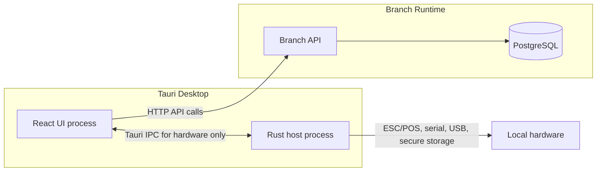

# Desktop Tauri architecture

`Desktop Tauri` is the branch operator shell for POS, warehouse, logistics, inventory, and local device integration.

Related docs:

- [Architecture overview](./overview.md)
- [Branch Runtime architecture](./branch-runtime.md)
- [Web vs Desktop surfaces](./web-vs-desktop-surfaces.md)
- [ADR-0024: Branch local HTTP API](../adr/0024-local-http-api.md)
- [ADR-0031: Branch Runtime secrets storage](../adr/0031-secrets-storage.md)

## Process shape

React owns business interaction. Rust owns host integration. Branch API owns business rules, persistence, idempotency, and outbox writes.

## React responsibilities

| Surface       | Responsibility                                                                |
| ------------- | ----------------------------------------------------------------------------- |
| POS           | Sales session, ticket creation, payments, returns when supported, receipts    |
| Warehouse     | Picking, packing, stock receiving, branch stock work                          |
| Logistics     | Route preparation, delivery proof review, liquidation support                 |
| Inventory     | Stock counts, transfers, adjustments, availability views                      |
| Orders        | Branch order intake and fulfillment flows that need local continuity          |
| Configuration | Branch endpoint, device pairing status, terminal selection, diagnostics links |
| Login         | User authentication, role-aware entry, session refresh                        |
| Navigation    | Operator shell, last-used terminal, branch mode routes                        |

React uses the same product language as the web operator panel while the migration is in progress. The UI can reuse components and generated SDK types where they match the Branch API contract.

## Rust host responsibilities

| Capability              | Responsibility                                                                    |
| ----------------------- | --------------------------------------------------------------------------------- |
| ESC/POS                 | Print receipts, cash drawer pulses, printer status where supported                |
| Scales                  | Read serial, USB, or vendor bridge values and return measurements to React        |
| Serial and USB          | Manage ports, permissions, retries, and diagnostics                               |
| Printers                | Enumerate devices, test print, expose printer health                              |
| Secure storage          | Store device credentials, endpoint selection, and local app secrets               |
| Updates                 | Coordinate desktop application updates                                            |
| mDNS client             | Discover Branch Servers on the LAN                                                |
| Windows service helpers | Read service health, collect logs, and open diagnostics for the principal machine |

Rust must not implement Binexus business rules. It can validate hardware command shape, protect secrets, and normalize device errors. Branch API decides whether a sale, adjustment, route transition, or order transition is valid.

## Web responsibilities

Web remains the cloud administration surface.

| Area               | Web keeps                                                                   |
| ------------------ | --------------------------------------------------------------------------- |
| Admin              | Tenant, branch, user, role, and policy administration                       |
| Configuration      | Cross-branch settings, feature flags, integrations, and branch setup        |
| Subscription       | Plans, billing, invoices, limits, and account status                        |
| Analytics          | Cloud dashboards, trends, comparisons, and historical reporting             |
| Supervision        | Multi-branch monitoring, approvals, exceptions, and audit review            |
| Synced data views  | Cloud-readable sales, stock, orders, routes, and operational summaries      |
| Catalog management | Products, price lists, categories, and shared reference data                |
| E-commerce         | Online storefront, channels, customer-facing flows, and future integrations |

The migration path does not delete existing web operator screens yet. Desktop becomes the branch operations authority over time. Web becomes the admin and cloud supervision surface.

## Communication contract

| Path                         | Protocol                  | Purpose                                                                     |
| ---------------------------- | ------------------------- | --------------------------------------------------------------------------- |
| Tauri React UI to Branch API | HTTP over LAN             | Business commands, queries, login, bootstrap, sync-visible operational data |
| Tauri React UI to Rust host  | Tauri IPC                 | Hardware access, secure storage, update checks, diagnostics                 |
| Rust host to Branch API      | Avoid by default          | Rust should not bypass React for business calls                             |
| Branch API to PostgreSQL     | Local database connection | Persistence, idempotency, outbox, inbox, branch projections                 |

React sends business commands to the Branch API. Rust commands serve hardware and host duties only.

## Non-goals

| Non-goal                              | Reason                                                        |
| ------------------------------------- | ------------------------------------------------------------- |
| Business rules in Rust                | The .NET modules already own invariants and events            |
| Local PostgreSQL per secondary device | The principal Branch Runtime owns branch data                 |
| Browser-only branch POS               | Branch operations need hardware integration and LAN discovery |
| Immediate deletion of web ops screens | The migration needs parity checks and a controlled rollout    |
