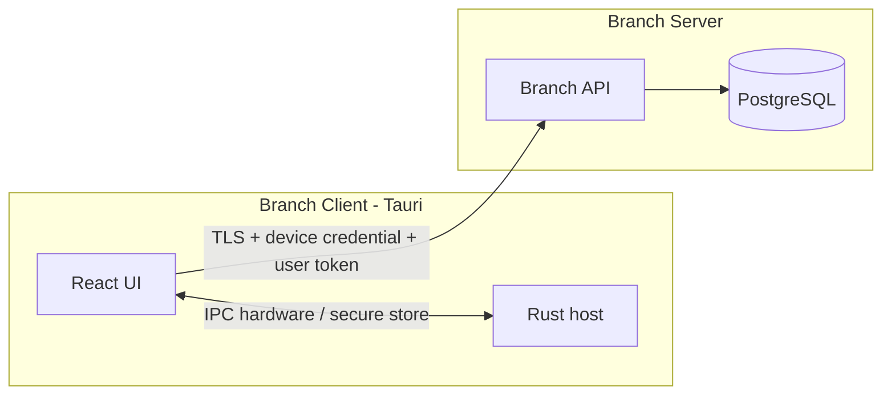

# Desktop Tauri architecture (Branch Client)

Tauri is the **Branch Client** shell: POS, warehouse, logistics, inventory, and host hardware integration. It is not Branch Server.

Related: [branch-runtime.md](./branch-runtime.md), [ADR-0020](../adr/0020-branch-client-pairing.md), [ADR-0023](../adr/0023-lan-api-security.md), [ADR-0027](../adr/0027-configuration-and-secrets.md).

## Process shape

## Responsibilities

| Layer         | Owns                                                     |
| ------------- | -------------------------------------------------------- |
| React         | Operator UX, carts, sessions UI, cached reads            |
| Rust          | ESC/POS, serial/USB, OS secure storage, installer invoke |
| Branch Server | Business rules, commit, journal, auth                    |

Tauri never receives PostgreSQL credentials and never writes the branch database directly.

## Local cache (non-authoritative)

Allowed: unconfirmed cart, config, visual session, cached reads, retry of lost responses with same `commandId`.

Not allowed as confirmed truth: sales or stock without Branch Server commit (ADR-0024).

## PR5 implementation note

As of PR5 the Branch Client ships as `apps/desktop` (Vite + React + Tauri 2.11.5):

- Pairing ceremony and Branch HTTP run in Rust only.
- Device secrets live in Windows Credential Manager via `keyring` 3.6.2 (`windows-native`).
- Single-instance uses an `fs2` file lock (no plugin).
- Config missing + envelope present yields `RecoveryRequired` (never auto-`Paired`).
- Out of scope still: POS UI, sync, mDNS, TLS pinning, installer, updater, hardware.

See [pr5-checkpoint-tauri-pairing-client.md](../migration/pr5-checkpoint-tauri-pairing-client.md).
