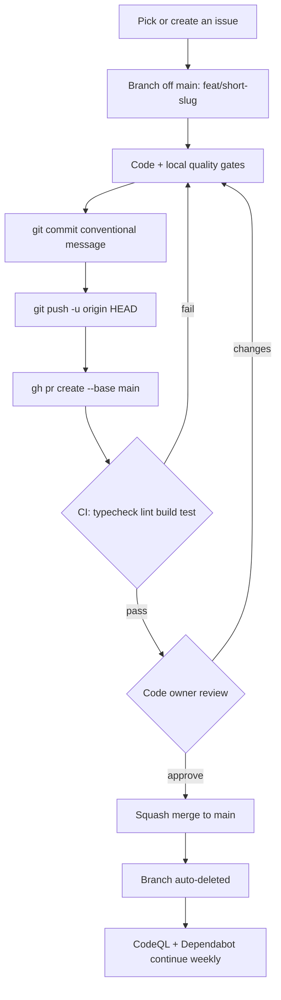
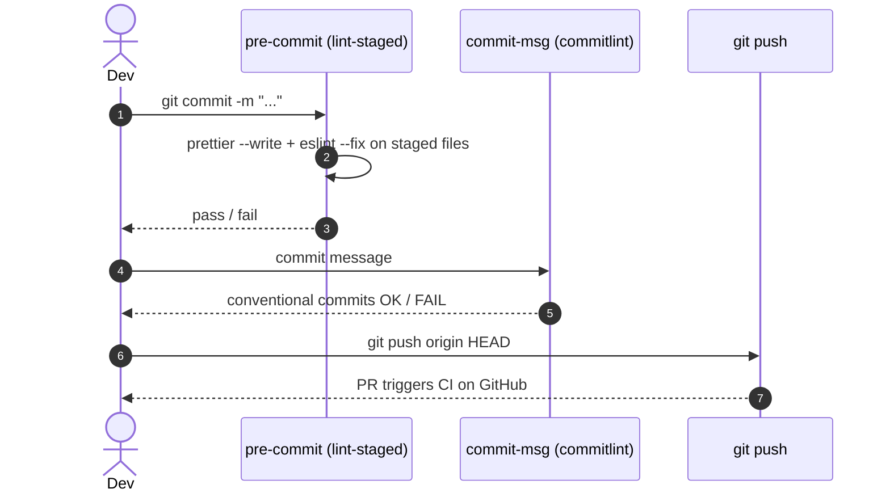
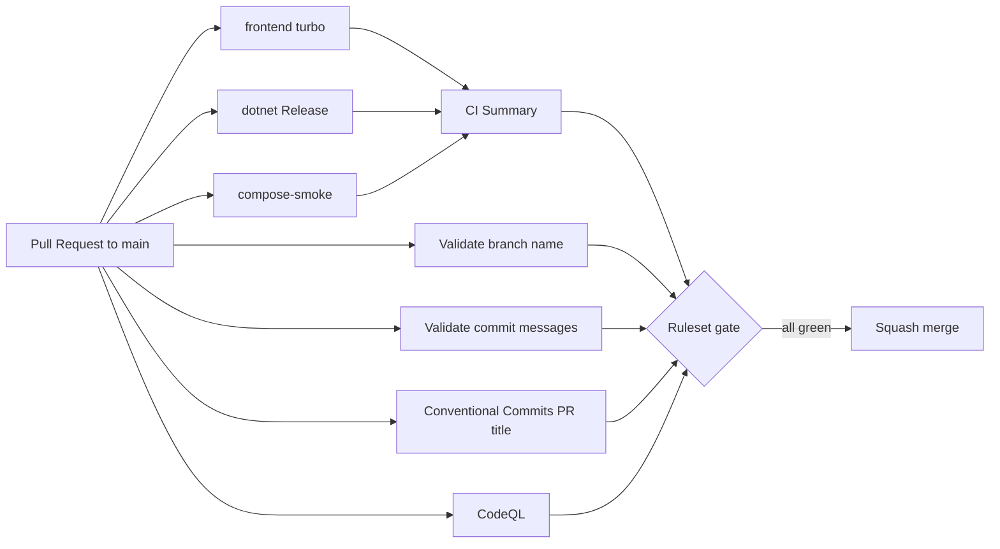

# Development workflow

This is the **trunk-based** flow used to keep `main` always-green while shipping fast.

## High-level loop



## Hard rules (enforced by the ruleset on `main`)

- No direct push to `main`.
- No force push, no deletion.
- Linear history (rebase, never merge `main` into a feature branch).
- 1 approving review from a CODEOWNER, dismissed on new push.
- All review threads resolved.
- Squash is the only allowed merge method.
- All required status checks green: `Typecheck`, `Lint`, `Build`, `Test`, `CI Summary`, `Conventional Commits`, `Validate branch name`, `Validate commit messages`, `Analyze javascript-typescript` (CodeQL).

## Branch and commit conventions (enforced by CI checks)

GitHub's modern Rulesets API does not expose `branch_name_pattern` or `commit_message_pattern` to personal accounts, so we enforce these via CI checks that are **listed as required status checks** in the ruleset. Net effect is the same: a PR with a bad branch name or a non-conventional commit cannot merge.

Every branch except `main`, `dependabot/**`, and `revert-**` must match:

```regex
^(feat|fix|refactor|docs|chore|test|perf|ci|build)/[a-z0-9][a-z0-9-]*$
```

Examples: `feat/orders-create-command`, `fix/jwt-refresh-rotation`, `docs/event-system-overview`.

Every commit message must follow Conventional Commits 1.0 (validated by `commitlint` against the full PR commit range).

## Local quality gates

Husky hooks block bad commits before they leave your machine.



Run the full battery yourself before opening the PR:

```bash
pnpm format
pnpm exec turbo run typecheck lint build
```

## CI on GitHub

Required jobs (post [ADR-0015](../adr/0015-nestjs-retirement-dotnet-sole-backend.md)): **frontend** (sdk + web), **backend** (.NET format/build/test + OpenAPI/SDK), **compose-smoke** (.NET + MinIO + Playwright). No Nest, Prisma, or Redis CI paths.



## Where things live

| Concern                | Path                                                                                                        |
| ---------------------- | ----------------------------------------------------------------------------------------------------------- |
| CI workflows           | [`.github/workflows/`](../../.github/workflows/)                                                            |
| PR template            | [`.github/pull_request_template.md`](../../.github/pull_request_template.md)                                |
| Issue templates        | [`.github/ISSUE_TEMPLATE/`](../../.github/ISSUE_TEMPLATE/)                                                  |
| CODEOWNERS             | [`.github/CODEOWNERS`](../../.github/CODEOWNERS)                                                            |
| Dependabot             | [`.github/dependabot.yml`](../../.github/dependabot.yml)                                                    |
| Labels (canonical)     | [`.github/labels.yml`](../../.github/labels.yml)                                                            |
| Rulesets (declarative) | [`.github/rulesets/`](../../.github/rulesets/)                                                              |
| Apply rulesets         | [`scripts/apply-rulesets.ps1`](../../scripts/apply-rulesets.ps1) / [`.sh`](../../scripts/apply-rulesets.sh) |
| Sync labels            | [`scripts/sync-labels.ps1`](../../scripts/sync-labels.ps1)                                                  |
| Conventions            | [`../../CONTRIBUTING.md`](../../CONTRIBUTING.md)                                                            |
| Security policy        | [`../../SECURITY.md`](../../SECURITY.md)                                                                    |

## Bootstrapping a fresh clone of this repo

```powershell
# One-time per machine
winget install --id GitHub.cli
gh auth login

# After cloning
pnpm install
cp .env.example .env
pnpm docker:up
pnpm db:seed:dev   # or db:seed:dev:win on Windows
# Clean DB recreate (no Prisma→EF data migration): see docs/migration/local-setup.md

# Owner only: push the policy
pwsh -File scripts/apply-rulesets.ps1 -Action apply
pwsh -File scripts/sync-labels.ps1
```

## Why this shape

- **Trunk-based** keeps the integration tax low. Long-lived feature branches drift and explode at merge.
- **Squash + linear history** keeps `main` readable and revertable per change.
- **Modern Rulesets** (not legacy branch protection) compose, allow scoped bypass actors, and are the path GitHub is investing in.
- **Conventional Commits** makes future automation (release notes, semver, changelogs) free.
- **Code-owner review** gates the most sensitive paths (architecture, foundation, security).
