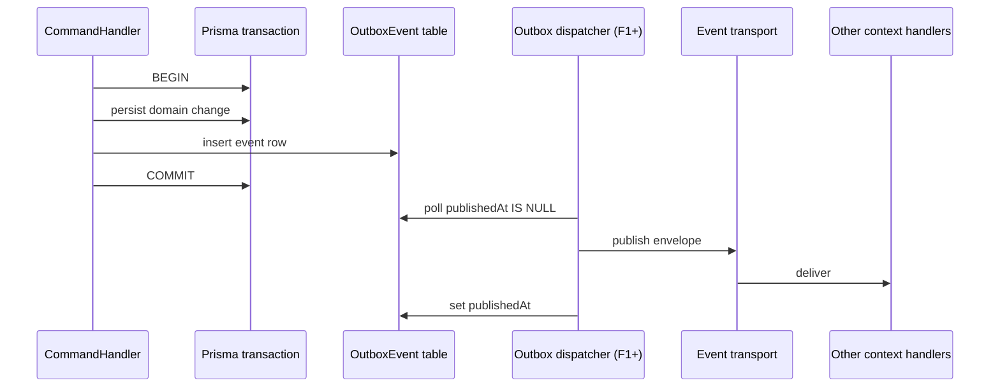

# Event system

## Goals

- **Decouple bounded contexts.** Cross-context communication is exclusively via events.
- **Survive crashes.** Events emitted as part of a command must not be lost if the process dies between the DB commit and the publish call.
- **Replayable.** Every event has a stable `id`, `correlationId`, `version`, and Zod schema.
- **Migratable transport.** Today: in-process emitter. Tomorrow: Redis Streams or Kafka, without changing producer code.

## Pieces

| Piece                                                           | Where                                                                                                              |
| --------------------------------------------------------------- | ------------------------------------------------------------------------------------------------------------------ |
| Event name registry                                             | [`packages/events/src/registry.ts`](../../packages/events/src/registry.ts)                                         |
| Envelope contract                                               | [`packages/events/src/envelope.ts`](../../packages/events/src/envelope.ts)                                         |
| Per-event Zod payload schemas                                   | [`packages/events/src/schemas/`](../../packages/events/src/schemas/)                                               |
| `EventBusService` (build + publish, runtime payload validation) | [`apps/backend/src/common/events/event-bus.service.ts`](../../apps/backend/src/common/events/event-bus.service.ts) |
| `OutboxService` (persist within the command's transaction)      | [`apps/backend/src/common/events/outbox.service.ts`](../../apps/backend/src/common/events/outbox.service.ts)       |
| `EVENT_TRANSPORT` provider                                      | [`apps/backend/src/common/events/transports/`](../../apps/backend/src/common/events/transports/)                   |

## Flow (the canonical recipe)

## Transports

- `InProcessEventTransport` (F0): just emits on `@nestjs/event-emitter`. Subscribers in the same process react synchronously.
- `RedisStreamsEventTransport` (stub today): swap the `EVENT_TRANSPORT` provider in `EventsModule` when ready. Dispatcher will move from in-proc poll to a hardened worker.

## Adding a new event

1. Add a key in `packages/events/src/registry.ts`.
2. Add a Zod schema file in `packages/events/src/schemas/<event>.ts`.
3. Wire it into `packages/events/src/schemas/index.ts → EventPayloadSchemas`.
4. Document it in [`docs/events/README.md`](../events/README.md).
5. Producer side: call `eventBus.publish('YOUR_EVENT', payload)` from inside the command's transaction (use `OutboxService.record(...)` with the same tx).
6. Consumer side: in another context, `@OnEvent('YOUR_EVENT')` on a handler method.

## Rules

- **Events are facts, not commands.** Past tense, no imperatives. `ORDER_CREATED`, not `CREATE_ORDER`.
- **Tiny payloads.** Carry IDs and minimal context. Consumers re-read details if needed.
- **Versioned.** Bumping `version` is a breaking change; document a migration in the same PR.
