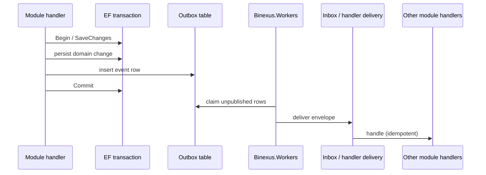

# Event system

## Goals

- **Decouple bounded contexts.** Cross-context communication is via integration events (and a few explicit application contracts).
- **Survive crashes.** Events staged in the outbox in the same EF transaction as the write are not lost on process death.
- **Replayable.** Every event has a stable `id`, `correlationId`, `version`, and a versioned payload contract.
- **No external broker required today.** Workers poll outbox → deliver to inbox / handlers in-process.

**Backend:** C# / .NET 10 / ASP.NET Core / EF Core / PostgreSQL. NestJS event bus / Redis Streams stub removed in [ADR-0015](../adr/0015-nestjs-retirement-dotnet-sole-backend.md).

## Pieces

| Piece                         | Where                                                                                                                                                                                                          |
| ----------------------------- | -------------------------------------------------------------------------------------------------------------------------------------------------------------------------------------------------------------- |
| Event contracts (runtime SoT) | Module producers/consumers under [`apps/backend/src/Modules/`](../../apps/backend/src/Modules/) + [`Messaging/`](../../apps/backend/src/Binexus.Platform/Messaging/) (`OutboxMessage.EventName`, payload JSON) |
| Human catalog                 | [`docs/events/README.md`](../events/README.md)                                                                                                                                                                 |
| Outbox processor              | [`apps/backend/src/Binexus.Platform/Messaging/`](../../apps/backend/src/Binexus.Platform/Messaging/)                                                                                                           |
| Workers host                  | [`apps/backend/src/Binexus.Workers/`](../../apps/backend/src/Binexus.Workers/)                                                                                                                                 |
| JSON snapshots (selected)     | [`docs/events/schemas/`](../events/schemas/)                                                                                                                                                                   |

There is no centralized `apps/backend/contracts/events` folder today (future proposal only — see catalog). `@binexus/events` (Zod) was removed.

## Flow (canonical recipe)

## Adding a new event

1. Add / version the contract under `apps/backend/contracts/events`.
2. Document it in [`docs/events/README.md`](../events/README.md).
3. Producer: stage the outbox row in the same EF transaction as the state change.
4. Consumer: register an inbox handler; treat redelivery as idempotent by envelope `id`.

## Rules

- **Events are facts, not commands.** Past tense. `ORDER_CREATED`, not `CREATE_ORDER`.
- **Tiny payloads.** Carry IDs and minimal context. Consumers re-read details if needed.
- **Versioned.** Bumping `version` is a breaking change; document the migration in the same PR.
