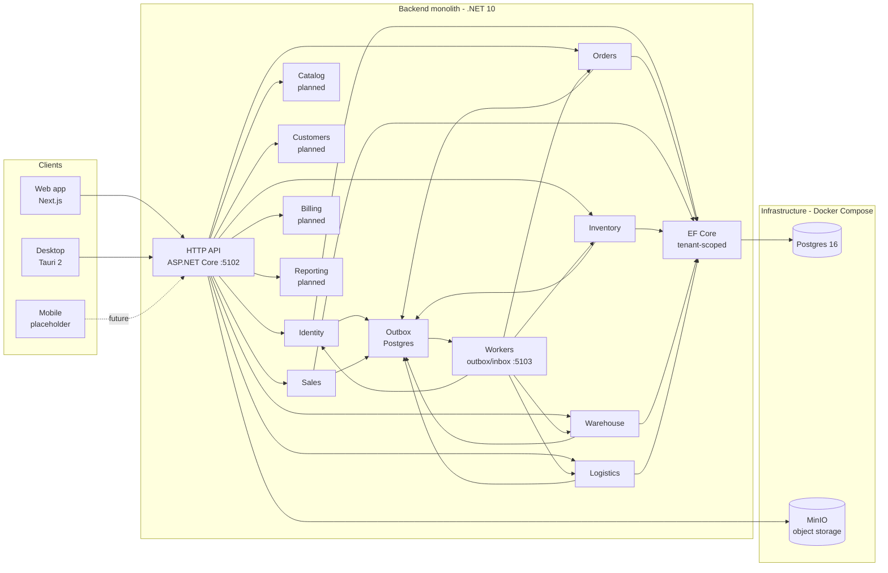
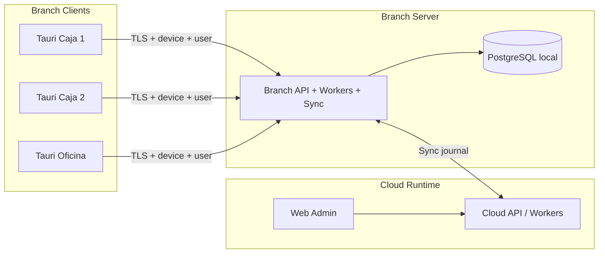

# Architecture overview

## Mantra

> **Foundation wide. Execution narrow.**

The architecture is designed to expand for five years. Features ship one bounded context at a time, focused and minimal.

## Stack (current)

| Layer          | Choice                                              |
| -------------- | --------------------------------------------------- |
| Backend        | C# / .NET 10 / ASP.NET Core / EF Core / PostgreSQL  |
| Web            | Next.js (App Router) + `@binexus/sdk` → Api `:5102` |
| Workers        | `Binexus.Workers` (outbox/inbox)                    |
| Object storage | MinIO (S3-compatible)                               |
| Auth           | JWT (access + refresh) + RBAC                       |

NestJS is **not** a supported runtime. Legacy backend: NestJS, removed in [ADR-0015](../adr/0015-nestjs-retirement-dotnet-sole-backend.md) migration.

## System shape

Detail: [`dotnet-backend.md`](./dotnet-backend.md). Bounded contexts: [`bounded-contexts.md`](./bounded-contexts.md).

## Target (Branch Runtime — Proposed)

Three installation modes: **Cloud Runtime**, **Branch Server**, **Branch Client**. See [`branch-runtime.md`](./branch-runtime.md) and [`../migration/branch-runtime-architecture-checkpoint.md`](../migration/branch-runtime-architecture-checkpoint.md).

Cloud is off the in-person sale path. Branch Client never writes PostgreSQL directly.

## Why a modular monolith

- Single founder, evolving domain — microservices' cost dwarfs their benefit.
- Cross-context invariants stay correctable as long as we don't network-split prematurely.
- Bounded contexts inside the monolith give us a clean **extraction surface** later: lift a context into a service once it has its own operational requirements.

## Why event-driven from day one

The operational surface (offline POS, route liquidation, returns, multi-step approvals) cannot be modeled with synchronous request/response without coupling everything. Events keep contexts independent and provide a natural audit trail.

## Why offline-first

Real LATAM operations have unreliable connectivity. The architecture allows for a future **local hub → cloud sync** topology. Phase 0 doesn't ship sync code, but it bakes in the contracts (event envelopes with `correlationId`, idempotent commands, branch-scoped writes) that make it possible later without rewrites.
