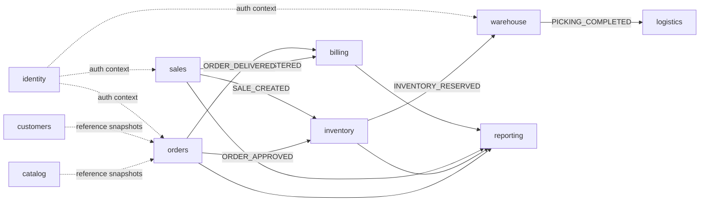

# Domains

A **domain** is a conceptual area of the business. A **bounded context** is the implementation boundary inside the modular monolith (see [`architecture/bounded-contexts.md`](../architecture/bounded-contexts.md)).

For Phase 1 we intentionally map domains 1:1 with bounded contexts. This is slightly more explicit than the previous five-context sketch, but it keeps ownership clean before the first real workflow (`CreateOrder -> ApproveOrder -> ReserveInventory -> GeneratePicking`) is implemented.

## Domain map

| Domain    | Bounded context | Phase | Status  | Source-of-truth ownership                            |
| --------- | --------------- | ----- | ------- | ---------------------------------------------------- |
| Identity  | `identity`      | 0     | Active  | tenants, branches, users, roles, refresh tokens      |
| Catalog   | `catalog`       | 1+    | Planned | products, SKUs, units, price lists, tax categories   |
| Customers | `customers`     | 1+    | Planned | customers, addresses, credit profile, contacts       |
| Orders    | `orders`        | 1     | Next    | order header, order lines, order state transitions   |
| Inventory | `inventory`     | 2     | Planned | stock balances, reservations, movements, transfers   |
| Warehouse | `warehouse`     | 3     | Planned | picking tasks, packing, staging, warehouse execution |
| Logistics | `logistics`     | 4-6   | Planned | routes, dispatch, delivery proof, liquidation        |
| Sales     | `sales`         | 5     | Planned | POS tickets, sales sessions, payment capture         |
| Billing   | `billing`       | 7     | Planned | invoices, receivables, payment allocation            |
| Reporting | `reporting`     | 8+    | Planned | projections/read models only                         |

## Dependency direction

Dashed arrows mean **read-only reference/snapshot usage**, not direct mutation. Solid arrows mean event flow.

## Cross-domain rules

1. **Events cross boundaries; repositories do not.** A context cannot import another context's Prisma repository or service.
2. **Reference data is snapshotted.** Orders store product/customer display data needed for historical correctness. They do not depend on live Catalog/Customers reads for old orders.
3. **Identity is the only direct lookup exception.** Contexts may rely on the authenticated request context and authorization metadata, but cannot mutate identity data.
4. **Reporting owns no operational truth.** It consumes events and builds projections.
5. **When a context needs another context to do work, emit a fact.** Example: Orders emits `ORDER_APPROVED`; Inventory decides how to reserve.

## Per-domain pages

- [`identity.md`](identity.md) - Tenant, User, Branch, Role, JWT lifecycle.
- [`catalog.md`](catalog.md) - Products, SKUs, units, prices, taxes.
- [`customers.md`](customers.md) - Customers, addresses, credit profile.
- [`orders.md`](orders.md) - Order lifecycle and the first real workflow.
- [`inventory.md`](inventory.md) - Stock, reservations, movements, transfers.
- [`warehouse.md`](warehouse.md) - Picking, packing, staging.
- [`logistics.md`](logistics.md) - Routes, dispatch, delivery, liquidation.
- [`sales.md`](sales.md) - POS sessions, tickets, payments.
- [`billing.md`](billing.md) - Invoices, receivables, payment allocation.
- [`reporting.md`](reporting.md) - Projections and analytics surfaces.
