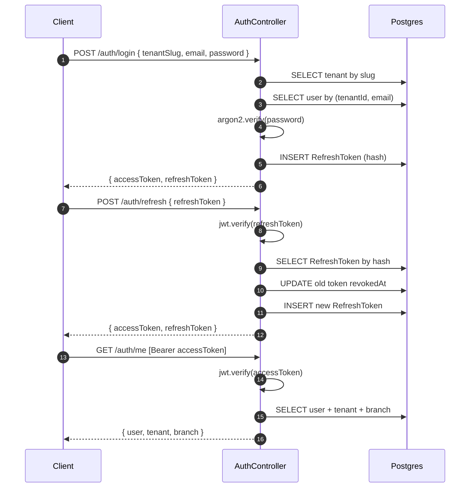

# Identity domain

The only domain with real code in Phase 0.

## Entities

- **Tenant** — top of the hierarchy. Has a unique `slug` used during login.
- **Branch** — a physical location within a tenant.
- **User** — belongs to a tenant, optionally to a branch. Has exactly one `Role`.
- **RefreshToken** — opaque token persisted hashed; rotated on every refresh.

See the canonical schema in [`apps/backend/prisma/schema.prisma`](../../apps/backend/prisma/schema.prisma).

## Roles (RBAC)

| Role          | Use case                                                                              |
| ------------- | ------------------------------------------------------------------------------------- |
| `SUPER_ADMIN` | Cross-tenant operators (platform owner). Bypasses tenant scoping via `@SkipTenant()`. |
| `ADMIN`       | Tenant administrator. Full access within the tenant.                                  |
| `CASHIER`     | POS operator at a branch.                                                             |
| `WAREHOUSE`   | Warehouse staff (picking, transfers).                                                 |
| `DRIVER`      | Route driver (future mobile app).                                                     |

## Auth flow



## JWT claims

```ts
interface JwtAccessClaims {
  sub: UserId; // user id
  tenantId: TenantId;
  role: Role;
  branchId: BranchId | null;
  iat: number;
  exp: number; // 15m by default
}
```

Refresh tokens carry the same claims + a `jti`, and have a 7-day TTL by default.

## Token security

- Passwords hashed with **Argon2id** (default `argon2` package settings).
- Refresh tokens stored as **SHA-256 hash** of the JWT — never the raw token.
- Refresh tokens are **single-use**: rotated on every `/auth/refresh`, the old one is revoked.
- Logout revokes the presented refresh token. Access tokens stay valid until they expire (acceptable trade-off; access TTL is 15m).
