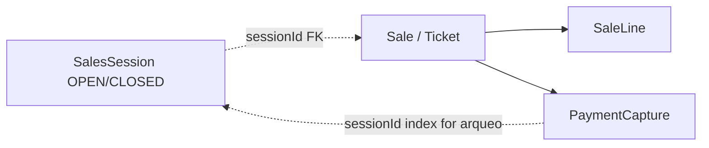

> **KEEP_HISTORICAL** — Nest deleted in Gate 7 (ADR-0015). Audit matrix kept for migration history.

# Sales F5.2 — auditoría Nest → .NET (pre-implementación)

**Fecha:** 2026-07-12  
**Alcance:** endpoints F5.2 en `apps/backend/src/contexts/sales/**`, Prisma `SalesSession`/`Ticket`/`TicketLine`/`PaymentCapture`, `packages/types/src/sales.ts` + `payments.ts`, `packages/events` sales schemas, SDK `/sales/*`, UI `apps/web/src/app/pos/page.tsx`.  
**Fuera de alcance:** credit (5.3), delivery orders (5.4), void/returns, Terminal catalog, `POS_RESTAURANT`.

**Referencias:** [`docs/domains/sales.md`](../domains/sales.md), [`docs/adr/0013-sales-pos-sub-slices-and-session-model.md`](../adr/0013-sales-pos-sub-slices-and-session-model.md), [`docs/architecture/dotnet-backend.md`](../architecture/dotnet-backend.md) §3.1–3.2, [`docs/migration/BASELINE.md`](BASELINE.md), [`docs/migration/inventory-nest-audit.md`](inventory-nest-audit.md).

---

## 1. Matriz

| Caso                | Regla Nest                                                                                                                                                | Persistencia                                         | Inventory                                  | Pago              | Evento                                   | HTTP                             | Test                                                                      |
| ------------------- | --------------------------------------------------------------------------------------------------------------------------------------------------------- | ---------------------------------------------------- | ------------------------------------------ | ----------------- | ---------------------------------------- | -------------------------------- | ------------------------------------------------------------------------- |
| Open session        | `terminalId` 1–50 trim; `openingFloatCents` ≥0 int; currency ISO3; `branchId` body o JWT; branch del tenant; **un OPEN** por `(tenant, branch, terminal)` | `SalesSession` OPEN + opening float                  | —                                          | —                 | `SALES_SESSION_OPENED`                   | `POST /sales/sessions/open`      | `open-sales-session.command.spec.ts` (happy + 409 second open)            |
| Get current         | `terminalId` query required; branch query o JWT; sin branch → `{ session: null }`                                                                         | read OPEN                                            | —                                          | —                 | —                                        | `GET /sales/sessions/current`    | — (solo read service)                                                     |
| Get by id           | tenant-scoped; 404 si no existe                                                                                                                           | read any status                                      | —                                          | —                 | —                                        | `GET /sales/sessions/:id`        | —                                                                         |
| Create sale (CASH)  | Session OPEN; currency = session; lines≥1; payments≥1; sum payments = total; walk-in label                                                                | `Ticket` COMPLETED + `TicketLine` + `PaymentCapture` | available≥qty; `onHand−=`; movement `SALE` | `CASH` only ok    | `SALE_CREATED` + 1× `PAYMENT_REGISTERED` | `POST /sales/sessions/:id/sales` | create-sale: single CASH + stock reject                                   |
| Create sale (split) | Same; methods ⊆ `CASH\|CARD\|TRANSFER`; CREDIT → 400; no max count                                                                                        | N captures                                           | same                                       | split exact total | `SALE_CREATED` + N× `PAYMENT_REGISTERED` | same                             | create-sale: 2-way, 3-way, sum mismatch; `validate-sale-payments.spec.ts` |
| Close match         | Session OPEN; expected = float + Σ CASH captures; cashier ok if declared = expected                                                                       | snapshot close fields; status CLOSED                 | —                                          | CASH-only arqueo  | `SALES_SESSION_CLOSED`                   | `POST /sales/sessions/:id/close` | close: match                                                              |
| Close discrepancy   | Same; `discrepancyCents = declared − expected`; needs ADMIN/SUPER_ADMIN + `discrepancyReason`                                                             | same + reason                                        | —                                          | —                 | same                                     | same                             | close: cashier 403; admin ok                                              |
| Feature off         | `POS_RETAIL` disabled → 403                                                                                                                               | —                                                    | —                                          | —                 | —                                        | all `/sales/*`                   | — (guard genérico)                                                        |
| Roles               | `CASHIER` \| `ADMIN` \| `SUPER_ADMIN`                                                                                                                     | —                                                    | —                                          | —                 | —                                        | class-level `@Roles`             | —                                                                         |

---

## 2. Aggregates: `SalesSession` vs `Sale` (Ticket)

Nest Prisma names the sale document **`Ticket`**. Migration target renames to **`Sale`** ([`BASELINE.md`](BASELINE.md), [`dotnet-backend.md`](../architecture/dotnet-backend.md)).

### `SalesSession` (AR)

Owns the cash-register shift, not the ticket collection in memory.

| Campo                                                        | Nest                          | Notas .NET                             |
| ------------------------------------------------------------ | ----------------------------- | -------------------------------------- |
| id, tenantId, branchId                                       | cuid / string                 | uuid v7                                |
| terminalId                                                   | string label (no catalog)     | VO string                              |
| status                                                       | `OPEN` \| `CLOSED`            | same                                   |
| openingFloatCents, currency                                  | int + ISO3                    | OpeningFloatMinorUnits                 |
| openedByUserId, openedAt                                     |                               |                                        |
| closedByUserId, closedAt                                     | null until close              |                                        |
| expectedClosingCents, declaredClosingCents, discrepancyCents | set on close                  |                                        |
| discrepancyReason, closeNotes                                | reason null if no discrepancy |                                        |
| tickets[], paymentCaptures[]                                 | Prisma navigations            | **drop from AR**; query by `sessionId` |

**Invariante DB:** partial unique `SalesSession_open_terminal_unique` on `(tenantId, branchId, terminalId) WHERE status = 'OPEN'` (SQL migration; not mirrored in Prisma schema model).

### `Sale` / `Ticket` (AR)

Independent sale transaction. Child entities: lines + payment captures.

| Campo                    | Nest `Ticket`                         | .NET `Sale`                                       |
| ------------------------ | ------------------------------------- | ------------------------------------------------- |
| id                       | cuid                                  | SaleId uuid v7                                    |
| sessionId                | FK                                    | SalesSessionId (ID only)                          |
| branchId, terminalId     | denormalized from session             | same                                              |
| customerLabel            | always `'walk-in'`                    | `WALK_IN_CUSTOMER_LABEL`                          |
| status                   | `COMPLETED` only                      | same v1                                           |
| totalCents, currency     | sum of line totals                    |                                                   |
| cashierUserId, createdAt |                                       |                                                   |
| lines                    | `TicketLine` snapshots                | SaleLine                                          |
| paymentCaptures          | child rows + denormalized `sessionId` | child of Sale; `sessionId` query index for arqueo |

**PaymentCapture** is not its own aggregate: created with the sale; sum(captures) == total is the F5.2 invariant.



---

## 3. Feature `POS_RETAIL` gating

- Controller: `@UseGuards(FeatureFlagGuard)` + `@RequireFeature(FeatureKey.POS_RETAIL)`.
- Guard: missing tenant → 403; flag disabled → `Feature "POS_RETAIL" is not enabled for tenant`.
- Seed: all flags including `POS_RETAIL` created with **`enabled: false`** (`apps/backend/prisma/seed.ts`). Demo must enable manually.
- Roles still apply when flag is on: `CASHIER` | `ADMIN` | `SUPER_ADMIN` via global `RolesGuard`.
- .NET: KEEP_EXACT class-level gate on all `/sales/*` ([`BASELINE.md`](BASELINE.md) §3.2 / feature matrix).

---

## 4. Open session rules

| Regla                                                               | Código                                                                                              |
| ------------------------------------------------------------------- | --------------------------------------------------------------------------------------------------- |
| `terminalId` required, trim, length 1–50                            | command `validate` + DTO                                                                            |
| `openingFloatCents` non-negative integer (0 allowed)                | command + DTO `@Min(0)`                                                                             |
| `currency` default `MXN`, must match `/^[A-Z]{3}$/`                 | controller default + validate                                                                       |
| `branchId` optional in body; else JWT `ctx.branchId`; missing → 400 | handler                                                                                             |
| Branch must belong to tenant                                        | `branch.findFirst`                                                                                  |
| Reject second OPEN on same terminal                                 | `ConflictException` 409; DB partial unique as backstop                                              |
| Roles                                                               | CASHIER/ADMIN/SUPER_ADMIN                                                                           |
| Event                                                               | `SALES_SESSION_OPENED` `{ sessionId, branchId, terminalId, openingFloatCents, currency, openedBy }` |

Multiple terminals on the same branch may have concurrent OPEN sessions (ADR-0013).

---

## 5. Create sale

### Walk-in customer

Hard-coded `customerLabel = WALK_IN_CUSTOMER_LABEL` (`'walk-in'`). No Customers module / no `customerId` input.

### Totals

- `lineTotalCents = quantity * unitPriceCents` (server-computed; client line totals ignored).
- `totalCents = sum(lineTotalCents)`.
- Sale currency defaults to `MXN`; must equal session currency.

### Split payments

- Body **requires** `payments[]` (no silent CASH default).
- ≥1 capture; **no server max** on count (UI caps at 3 distinct methods).
- Each `amountCents` positive integer.
- Allowed: `POS_WALK_IN_PAYMENT_METHODS` = `CASH | CARD | TRANSFER`.
- `CREDIT` → 400 with message deferred to 5.3.
- `sum(amountCents) === totalCents` exactly (no over/under pay, no change).

### CASH / CARD / TRANSFER vs arqueo

All three create `PaymentCapture` rows and emit `PAYMENT_REGISTERED`. Only **CASH** amounts enter `computeSessionCashExpected`. Example: $100 ticket with $50 CASH + $50 CARD adds **50** to expected drawer cash.

### Inventory decrement (inline Nest)

Same Prisma TX as ticket + payments:

1. For each line: `available = onHand - reserved`; reject if `available < quantity`.
2. Create ticket, lines, captures.
3. For each line: `StockItem.onHand` decrement; `StockMovement` type `SALE`, quantity **negative**.
4. If post-update `onHand < 0` → 400 (covers multi-line same SKU oversell within one request).

Does **not** touch `reserved`. No async inventory handler on `SALE_CREATED`.

**Gap for .NET:** replace inline Prisma with `IInventorySaleApi.DecrementForSaleAsync` in the same TX (port already exists in Inventory.Contracts).

---

## 6. Close session

### Expected cash

```
expectedCents = openingFloatCents + sum(PaymentCapture.amountCents where method = CASH and sessionId)
```

Currency mismatch between session and any CASH capture → 400 (`SESSION_CASH_CURRENCY_MISMATCH`).

### Declared / discrepancy / snapshot

| Campo                  | Valor                                             |
| ---------------------- | ------------------------------------------------- |
| `declaredClosingCents` | required, ≥0                                      |
| `discrepancyCents`     | `declared − expected`                             |
| `hasDiscrepancy`       | `discrepancyCents !== 0`                          |
| Supervisor             | ADMIN/SUPER_ADMIN + non-empty `discrepancyReason` |
| Cashier match          | allowed without reason                            |
| `discrepancyReason`    | stored only if discrepancy; else null             |
| `closeNotes`           | optional `notes`                                  |
| status                 | CLOSED; `closedAt`, `closedByUserId` set          |

Shared helper: `assertCashDiscrepancyCloseAllowed` (same pattern as route liquidation G3).

---

## 7. Concurrency / idempotency

| Área                  | Nest hoy                                                         | Riesgo / .NET                                                                                   |
| --------------------- | ---------------------------------------------------------------- | ----------------------------------------------------------------------------------------------- |
| Open race             | findFirst then create; partial unique index                      | Map unique violation → 409                                                                      |
| Close twice           | status ≠ OPEN → 400                                              | State-based; optional RowVersion on session                                                     |
| Create sale on closed | 400                                                              | same                                                                                            |
| Stock race            | check then decrement in TX; no `FOR UPDATE` explicit             | .NET Inventory already tests concurrent last-unit; use port + RowVersion                        |
| Multi-line same SKU   | pre-check per line independent; post-decrement catches           | Prefer accumulate qty per product before check                                                  |
| `Idempotency-Key`     | mapped to `commandId` / causation only; **no idempotency store** | Same as other Nest contexts; .NET may add OperationKey on stock (already in `DecrementForSale`) |
| Sale HTTP retry       | can double-sell                                                  | Need sale-level idempotency key or client discipline                                            |

---

## 8. Events emitted

| Evento                 | Cuándo             | Payload clave                                          | Consumers Nest      |
| ---------------------- | ------------------ | ------------------------------------------------------ | ------------------- |
| `SALES_SESSION_OPENED` | open TX            | session, terminal, float, openedBy                     | none                |
| `SALE_CREATED`         | after ticket+stock | `saleId` + `ticketId` (same id), lines, **payments[]** | none (stock inline) |
| `PAYMENT_REGISTERED`   | per capture        | `paymentId`, `saleId`, amount, method                  | billing\* (planned) |
| `SALES_SESSION_CLOSED` | close TX           | expected/declared/discrepancy, closedBy                | none                |

Schemas: `packages/events/src/schemas/sales-session-*.ts`, `sale-created.ts`, `payment-registered.ts`.  
Catalog: [`docs/events/README.md`](../events/README.md).

Outbox recorded in the same Prisma `$transaction` as writes.

---

## 9. What the frontend uses

**Page:** `apps/web/src/app/pos/page.tsx` via `@binexus/sdk`.

| SDK / HTTP                                               | Used?                                                      |
| -------------------------------------------------------- | ---------------------------------------------------------- |
| `openSalesSession` → `POST /sales/sessions/open`         | yes                                                        |
| `getCurrentSalesSession` → `GET /sales/sessions/current` | yes (load + after sale)                                    |
| `getSalesSession` → `GET /sales/sessions/:id`            | **no**                                                     |
| `createSale` → `POST …/sales`                            | yes (lines + payments, currency from session)              |
| `closeSalesSession` → `POST …/close`                     | yes (`declaredClosingCents`, optional `discrepancyReason`) |
| `listStockItems`                                         | yes (cart source)                                          |

UI-only constraints (stricter than API):

- At most one payment line per method (API allows repeated method).
- Max payment lines = 3 (`POS_WALK_IN_PAYMENT_METHODS.length`).
- Manual unit price via `prompt`; `productName` set to `productId`.
- Does not send `branchId` on open (relies on JWT branch).

---

## 10. Inventory API surface for `IInventorySaleApi.DecrementForSaleAsync`

Nest behavior to preserve via the existing .NET port (`Binexus.Modules.Inventory.Contracts`):

```csharp
Task<InventorySaleDecrementResult> DecrementForSaleAsync(
    InventorySaleDecrementRequest request, // TenantId, SaleId, Lines[]
    CancellationToken ct);
```

| Nest inline                                              | Port contract                                                                                                   |
| -------------------------------------------------------- | --------------------------------------------------------------------------------------------------------------- |
| Per line: branch = session.branchId, productId, quantity | `InventorySaleLine(BranchId, SaleLineId, ProductId, Quantity)`                                                  |
| `available = onHand - reserved` before sell              | `item.Available < qty` → `InsufficientStock`                                                                    |
| `onHand -= qty`; reserved unchanged                      | `item.Sell(qty)`                                                                                                |
| `StockMovement` SALE, quantity negative                  | `StockMovementType.Sale`, negative qty                                                                          |
| correlation/causation on movement                        | Nest sets correlationId/causationId; .NET uses `OperationKey = SaleLineKey(saleId, saleLineId)` for idempotency |
| all-or-nothing with sale TX                              | Shared DbContext / ambient TX with Sales handler                                                                |
| no `STOCK_SOLD` domain event in Nest                     | .NET `InventorySaleService` records `STOCK_SOLD` — document as intentional .NET addition or align               |

Failure → Sales maps to 400 (Nest) / Result failure (prefer domain codes + HTTP mapping).

---

## 11. Gaps / mismatches (docs vs code)

| #   | Doc / claim                                                                                          | Código                                                         |
| --- | ---------------------------------------------------------------------------------------------------- | -------------------------------------------------------------- |
| 1   | [`bounded-contexts.md`](../architecture/bounded-contexts.md) lists `sales` among “folder stubs only” | `SalesModule` registered; F5.2 shipped                         |
| 2   | Prisma comment on `PaymentCapture`: “5.1 = single CASH”                                              | F5.2 multi-capture                                             |
| 3   | Domain “Ticket” vs architecture “Sale”                                                               | Dual naming; HTTP still returns `ticket` in `CreateSaleResult` |
| 4   | Event graph “sales → inventory” via `SALE_CREATED`                                                   | Inventory decrement is **inline**, not event-driven            |
| 5   | Notion “F5 · Sales / POS (Planned)”                                                                  | Repo status active 5.2                                         |
| 6   | ADR-0013 5.1 “single CASH”                                                                           | Superseded by 5.2 split; domain doc updated                    |
| 7   | Partial unique OPEN terminal                                                                         | Exists in SQL; **absent from Prisma model** annotations        |
| 8   | Frontend method uniqueness                                                                           | Not enforced server-side                                       |
| 9   | Idempotent HTTP sales                                                                                | Header accepted; no replay store                               |
| 10  | `GET /sales/sessions/:id`                                                                            | Implemented + SDK; unused by `/pos`                            |

---

## 12. Brief de implementación .NET (no implementar en este task)

### Models / tables

- `SalesSession` + partial unique OPEN `(TenantId, BranchId, TerminalId)`.
- `Sale` (map Nest `Ticket`), `SaleLine`, `PaymentCapture` (FK SaleId + indexed SessionId).
- Status enums: `OPEN|CLOSED`, `COMPLETED`.
- Money: `int` cents; currency `char(3)`.
- `RowVersion` on `SalesSession` (BASELINE).

### Contracts / ports

- HTTP KEEP_EXACT for the five routes; DTOs aligned with `@binexus/types` (`OpenSalesSession*`, `CreateSale*`, `CloseSalesSession*`, `SalesSessionSummary`, `TicketSummary` → consider `SaleSummary` alias later without breaking JSON `ticket` key if web depends on it).
- `IInventorySaleApi.DecrementForSaleAsync` in same TX as sale create (already in Inventory).
- Feature `POS_RETAIL` + roles CASHIER/ADMIN/SUPER_ADMIN.
- Outbox: four event types with existing Zod-equivalent payloads.

### Endpoints

1. `POST /sales/sessions/open`
2. `GET /sales/sessions/current?terminalId&branchId?`
3. `GET /sales/sessions/{id}`
4. `POST /sales/sessions/{id}/sales`
5. `POST /sales/sessions/{id}/close`

### Tests to write

| Test                                             | Assert                                                  |
| ------------------------------------------------ | ------------------------------------------------------- |
| Open happy                                       | OPEN session + outbox OPENED                            |
| Open duplicate terminal                          | 409 / unique                                            |
| Create CASH                                      | ticket + 1 capture + stock − + SALE_CREATED + 1 PAYMENT |
| Create split 2/3                                 | N captures; N PAYMENT events; arqueo ignores non-cash   |
| Payment sum mismatch                             | 400                                                     |
| CREDIT                                           | 400                                                     |
| Insufficient stock / reserved blocking available | 400; no ticket                                          |
| Concurrent last unit                             | one winner (via Inventory port)                         |
| Close match as cashier                           | CLOSED; discrepancy 0                                   |
| Close discrepancy as cashier                     | 403                                                     |
| Close discrepancy as admin + reason              | CLOSED; fields set                                      |
| POS_RETAIL off                                   | 403                                                     |
| Wrong role (e.g. DRIVER)                         | 403                                                     |
| Create on CLOSED session                         | 400                                                     |
| Currency mismatch sale vs session                | 400                                                     |

### Deferred (do not pull into this slice)

Credit, delivery-from-POS, void/returns, Terminal catalog, restaurant, Nest→event inventory handler.
