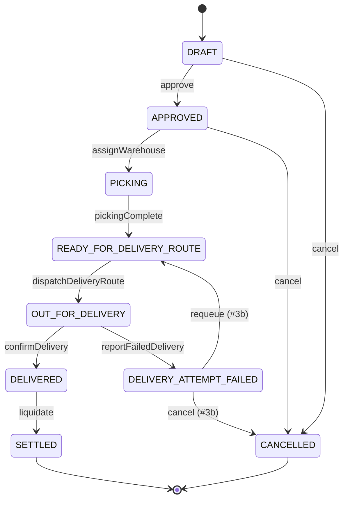

# Order state machine

The canonical reference. Code in [`packages/types/src/orders.ts`](../../packages/types/src/orders.ts) MUST stay in sync with this document.

## Transitions

| From                       | Action                  | To                         | Emits                                                 | Notes                                                       |
| -------------------------- | ----------------------- | -------------------------- | ----------------------------------------------------- | ----------------------------------------------------------- |
| `DRAFT`                    | `approve`               | `APPROVED`                 | `ORDER_APPROVED`                                      | Requires credit check (B2B). Reserves stock (event-driven). |
| `DRAFT`                    | `cancel`                | `CANCELLED`                | `ORDER_CANCELLED`                                     | No side effects beyond audit.                               |
| `APPROVED`                 | `assignWarehouse`       | `PICKING`                  | `ORDER_PICKING_STARTED`                               | Warehouse staff picks up the task.                          |
| `APPROVED`                 | `cancel`                | `CANCELLED`                | `ORDER_CANCELLED`                                     | Triggers stock release.                                     |
| `PICKING`                  | `pickingComplete`       | `READY_FOR_DELIVERY_ROUTE` | `PICKING_COMPLETED`, `ORDER_READY_FOR_DELIVERY_ROUTE` | Items prepared; Logistics projects route candidate.         |
| `READY_FOR_DELIVERY_ROUTE` | `dispatchDeliveryRoute` | `OUT_FOR_DELIVERY`         | `DELIVERY_ROUTE_DISPATCHED`                           | Assigned to a delivery route + driver.                      |
| `OUT_FOR_DELIVERY`         | `confirmDelivery`       | `DELIVERED`                | `ORDER_DELIVERED`                                     | Proof of delivery captured.                                 |
| `OUT_FOR_DELIVERY`         | `reportFailedDelivery`  | `DELIVERY_ATTEMPT_FAILED`  | `DELIVERY_FAILED` (Logistics)                         | Operational pause; human resolves in slice #3b.             |
| `DELIVERY_ATTEMPT_FAILED`  | `requeue` (#3b)         | `READY_FOR_DELIVERY_ROUTE` | (planned)                                             | Retry on a future route.                                    |
| `DELIVERY_ATTEMPT_FAILED`  | `cancel` (#3b)          | `CANCELLED`                | `ORDER_CANCELLED` (planned)                           | Release stock via existing cancel path.                     |
| `DELIVERED`                | `liquidate`             | `SETTLED`                  | `ORDER_SETTLED`                                       | Cash + returns reconciled.                                  |

## Terminal states

- `SETTLED` — happy path complete.
- `CANCELLED` — order halted; allowed from `DRAFT`, `APPROVED`, or (planned #3b) `DELIVERY_ATTEMPT_FAILED`.

## Disallowed transitions

Anything not in the table above. The helper [`canTransition()`](../../packages/types/src/orders.ts) returns `false` for them and the command handler MUST throw `InvalidOrderTransitionError`.

## When to add a state

- A new state is justified only if there is a meaningful pause (human action, async work, time delay) where the order may live.
- A state that always immediately transitions to another is not a state — it's an event.

## Refactoring this diagram

If you change anything here:

1. Update `packages/types/src/orders.ts` (`OrderState`, `ORDER_TRANSITIONS`).
2. Update any handler that branches on state.
3. Add migration notes if running orders may be in the deprecated state.
4. Note the change in the PR description with a "STATES" tag for reviewers.
