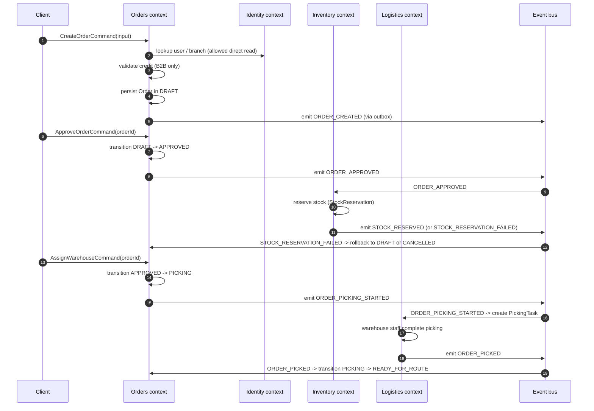

# Workflow: order creation → ready for route

The end-to-end flow we will implement in Phase 1. Documents the choreography between bounded contexts so we keep contracts honest **before** writing code.

## Steps in plain language

1. **Create** — `Orders` writes the order in `DRAFT`, emits `ORDER_CREATED`.
2. **Validate credit** — synchronous inside `Orders`, applies only to B2B tenants (open question to resolve at Phase 1 kickoff).
3. **Approve** — `Orders` transitions to `APPROVED`, emits `ORDER_APPROVED`.
4. **Reserve stock** — `Inventory` reacts to `ORDER_APPROVED`, atomically reserves stock and emits either success or failure.
5. **Compensate on failure** — `Orders` reacts to `STOCK_RESERVATION_FAILED` and either reverts to `DRAFT` or cancels (rule TBD per tenant).
6. **Assign warehouse** — `Orders` transitions to `PICKING`, emits `ORDER_PICKING_STARTED`.
7. **Picking** — `Logistics` creates a picking task. When complete, it emits `ORDER_PICKED`.
8. **Ready for route** — `Orders` reacts to `ORDER_PICKED` and transitions to `READY_FOR_ROUTE`. From here the Routes workflow takes over.

## Cross-context contracts implied by this flow

- `Orders` consumes `STOCK_RESERVATION_FAILED`, `STOCK_RESERVED`, `ORDER_PICKED`.
- `Orders` emits `ORDER_CREATED`, `ORDER_APPROVED`, `ORDER_CANCELLED`, `ORDER_PICKING_STARTED`.
- `Inventory` consumes `ORDER_APPROVED`, `ORDER_CANCELLED`.
- `Inventory` emits `STOCK_RESERVED`, `STOCK_RESERVATION_FAILED`, `STOCK_RELEASED`.
- `Logistics` consumes `ORDER_PICKING_STARTED`.
- `Logistics` emits `ORDER_PICKED`.

Each of those events needs a Zod schema in `packages/events/src/schemas/` before its producer ships.

## Idempotency

- All command endpoints accept an `Idempotency-Key` header. Replays with the same key return the same result without re-executing side effects.
- All event handlers are idempotent on `event.id` (store the last processed `event.id` per consumer / per aggregate).
